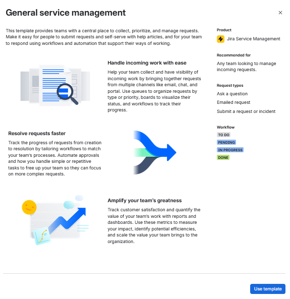
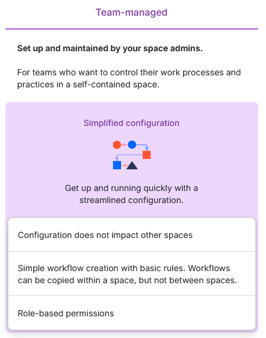
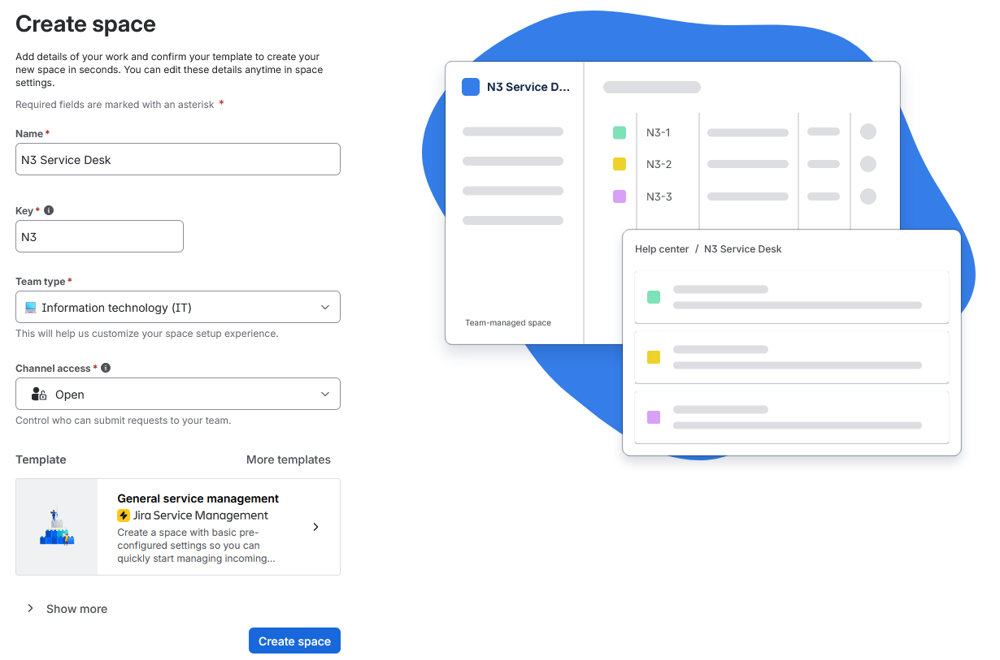
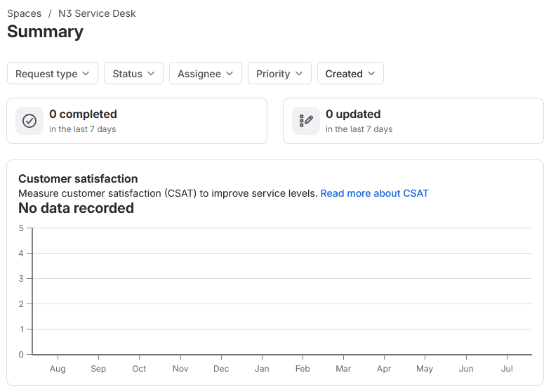

# Jira Cloud Setup

N3 was created as a Jira Service Management space through Atlassian's Service Collection interface.

This stage records the base Jira setup for the lab, from space configuration through to the first created view. Request types, queues, SLA fields, and ticket handling continue in later reports.

## Work Path

| Step | Area               | Action                                            |
| ---- | ------------------ | ------------------------------------------------- |
| 01   | Template           | Select General service management.                |
| 02   | Management         | Use a team-managed service space.                 |
| 03   | Space Details      | Create `N3 Service Desk` with the `N3` key.       |
| 04   | Created Space      | Confirm that the N3 service space opens in Jira.  |

## Template Selection

The setup used the General service management template as the Jira Service Management base. This gave N3 a service desk starting point without using the Premium IT service management template, as shown in Figure 2.1.

The N3-specific request types, queues, and ticket workflow are configured separately in the following reports.

*Figure 2.1 - General service management selected as the N3 starting template.*

## Space Management

The service space was created as team-managed. Figure 2.2 shows the management choice used before the space details were entered.

A team-managed space keeps the N3 configuration contained inside this project, which fits the lab because the request types, fields, workflow, and queues are being built for this service desk.

*Figure 2.2 - Team-managed selected for the N3 service space.*

## Space Details

The create screen was completed with the N3 name, project key, IT team type, open channel access, and the selected template (Figure 2.3).

| Setting        | Value                       |
| -------------- | --------------------------- |
| Name           | `N3 Service Desk`           |
| Key            | `N3`                        |
| Team Type      | Information technology (IT) |
| Channel Access | Open                        |
| Template       | General service management  |
| Management     | Team-managed space          |

Open channel access was used so later tickets can be raised through the Jira service desk flow.

*Figure 2.3 - Create space screen with the N3 service desk settings.*

## Created Space

After creation, Jira opened the N3 Service Desk Summary page. This confirmed that the Jira Service Management space existed and was ready for the next stage (Figure 2.4).

No request types, queues, SLA fields, or ticket scenarios were configured at this point.

*Figure 2.4 - N3 Service Desk opened after creation.*

## Result

The `N3 Service Desk` space was created and opened successfully in Jira Service Management. Request types, queues, SLA fields, and ticket handling continue in the following reports.

## Navigation

| Previous                                               | Current              | Next                                                  |
| ------------------------------------------------------ | -------------------- | ----------------------------------------------------- |
| [01 Service Desk Overview](01-service-desk-overview.md) | 02 Jira Cloud Setup | [03 Request Type Forms](03-request-type-forms.md)     |