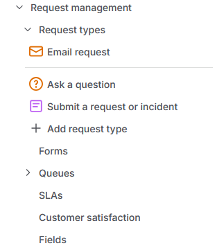
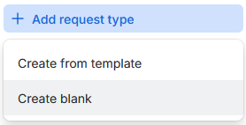
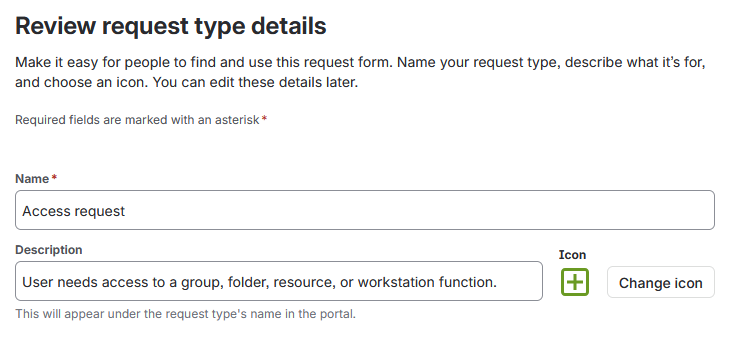
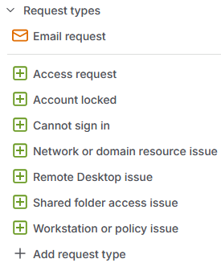
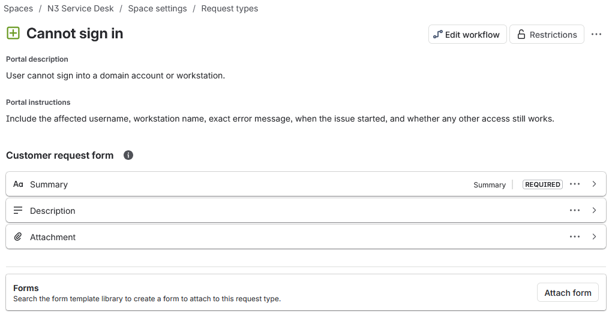
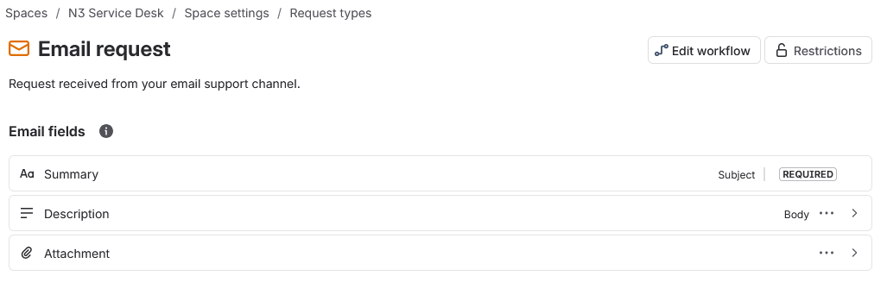
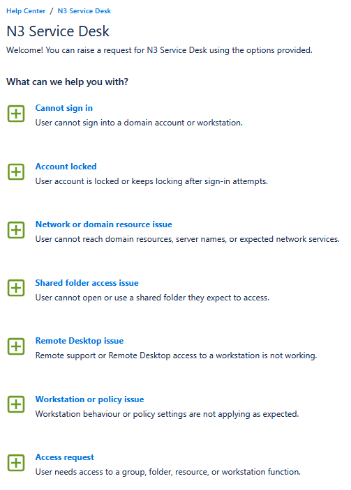

# Request Type Forms

N3 request intake was built from the default Jira Service Management request types created by the General Service Management template.

This stage records the default request types, the blank request type creation path, the N3 request type set, the shared form structure, the retained email request type, and the requester-facing portal view.

## Work Path

| Step | Area                  | Action                                                        |
| ---- | --------------------- | ------------------------------------------------------------- |
| 01   | Default Request Types | Review the request types created by the template.             |
| 02   | Request Type Creation | Create N3 request types from blank request types.             |
| 03   | Request Type List     | Remove generic defaults and keep the N3 intake paths.         |
| 04   | Form Structure        | Add `Summary`, `Description`, and `Attachment` to N3 forms.   |
| 05   | Email Request         | Retain the email request type for the email support channel.  |
| 06   | Portal View           | Confirm the request options shown to users.                   |

## Default Requests

The General Service Management template created three default request types: `Email request`, `Ask a question`, and `Submit a request or incident` (Figure 3.1).

*Figure 3.1 - Default request types created by the General Service Management template.*

## Request Creation

N3 request types were created from blank request types. This kept the intake structure focused on the support paths used by the lab.

The blank creation option is shown in Figure 3.2.

*Figure 3.2 - Blank request type creation selected for N3 request types.*

Each request type was given a short user-facing name and portal description. Figure 3.3 shows the creation details for `Access request`.

*Figure 3.3 - Access request created with a portal description.*

## Types Set

The generic defaults were removed after the N3 request types were created. `Email request` was retained for the email support channel.

Figure 3.4 shows the final request type list used for the N3 ticket workflow.

*Figure 3.4 - N3 request type list after the support paths were created.*

| Request Type                     | Portal Description                                                              | Portal Instructions                                                                                                                     |
| -------------------------------- | ------------------------------------------------------------------------------- | --------------------------------------------------------------------------------------------------------------------------------------- |
| Access request                   | User needs access to a group, folder, resource, or workstation function.        | Include the username, access needed, reason for the request, and whether the work is blocked.                                           |
| Account locked                   | User account is locked or keeps locking after sign-in attempts.                 | Include the affected username, workstation name, when the lockout started, and whether it keeps happening after unlock.                 |
| Cannot sign in                   | User cannot sign in to a domain account or workstation.                         | Include the affected username, workstation name, exact error message, when the issue started, and whether any other access still works. |
| Network or domain resource issue | User cannot reach domain resources, server names, or expected network services. | Include the workstation name, affected service or resource, error message, and whether internet access still works.                     |
| Remote Desktop issue             | Remote support or Remote Desktop access to a workstation is not working.        | Include the workstation name, target device, error message, and whether local sign-in still works.                                      |
| Shared folder access issue       | User cannot open or use a shared folder they expect to access.                  | Include the username, shared folder path, error message, and whether access worked before.                                              |
| Workstation or policy issue      | Workstation behaviour or policy settings are not applying as expected.          | Include the workstation name, user account, expected behaviour, current behaviour, and when it was first noticed.                       |

## Form Structure

The N3 request types use the same base form structure:

| Field         | Use                                            |
| ------------- | ---------------------------------------------- |
| Summary       | Short ticket title shown in the Jira queue.    |
| Description   | User explanation of the issue or request.      |
| Attachment    | Screenshot or supporting file from the user.   |

`Cannot sign in` was used as the detailed form example. The form asks for the affected username, workstation name, error message, start time, and whether any other access still works (Figure 3.5).

*Figure 3.5 - Cannot sign in request form with summary, description, attachment, and requester guidance.*

## Email Request

`Email request` remained in place because it is tied to Jira's email support channel. The email subject maps to `Summary`, the email body maps to `Description`, and email `Attachment` remains available on the request.

The retained email request type is shown in Figure 3.6.

*Figure 3.6 - Email request retained for email-routed support work.*

## Portal View

The requester-facing view confirmed that the N3 request types were available through the service desk portal.

Figure 3.7 shows the available request options for N3 Service Desk.

*Figure 3.7 - N3 Service Desk request options shown in the help center.*

## Result

The N3 request intake structure was configured.

The service desk now has defined request types, user-facing descriptions, portal instructions, and a shared request form structure for ticket creation. The next stage configures queues and priority handling.

## Navigation

| Previous                                      | Current                 | Next                                                  |
| --------------------------------------------- | ----------------------- | ----------------------------------------------------- |
| [02 Jira Cloud Setup](02-jira-cloud-setup.md) | 03 Request Type Forms   | [04 Queue Priority Model](04-queue-priority-model.md) |