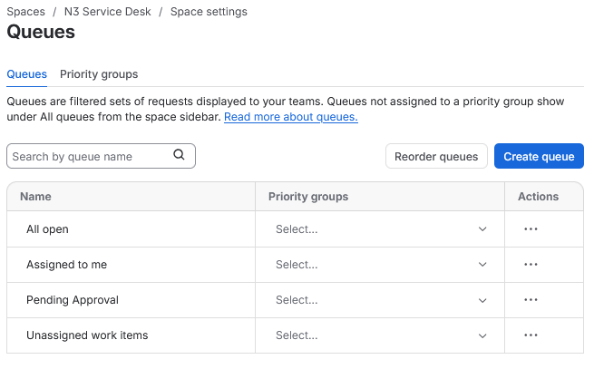
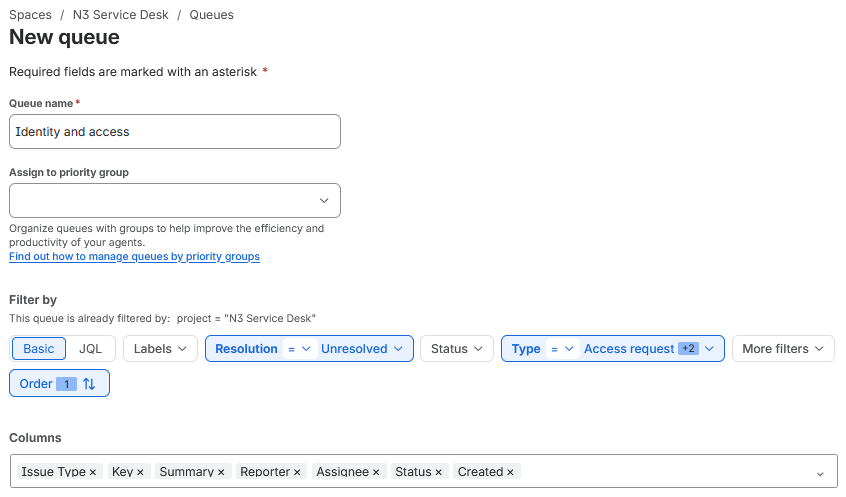
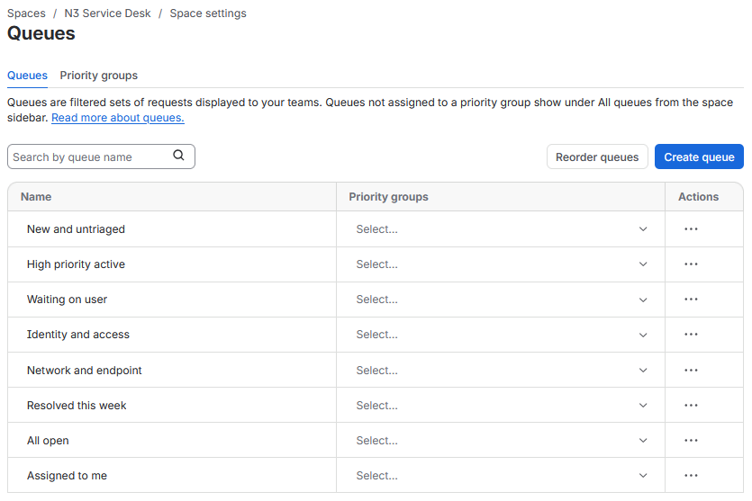

# Queue Priority Model

N3 queues were configured as agent-side working views for service desk handling.

This stage records the default Jira queues, the N3 queue model, queue filters, working order, and priority handling used before the live ticket simulation starts.

## Work Path

| Step | Area                  | Action                                                          |
| ---- | --------------------- | --------------------------------------------------------------- |
| 01   | Default Queues        | Review the working views created by Jira.                       |
| 02   | Queue Filters         | Build custom queues using status, assignee, priority, and type. |
| 03   | Queue Model           | Group related support work without over-splitting the sidebar.  |
| 04   | Queue Order           | Arrange the queues into the order used during ticket handling.  |

## Default Views

Jira created four default working views when the service space was created: `All open`, `Assigned to me`, `Pending Approval`, and `Unassigned work items`.

The default views are shown in Figure 4.1 before the N3 queue model was added.

*Figure 4.1 - Default Jira working views before N3 queue configuration.*

## Queue Model

The N3 queue model was kept small enough to stay usable during the ticket run.

The queues separate new intake, high-priority work, waiting tickets, technical categories, recently resolved work, and fallback views. This avoids creating one queue for every request type while still giving enough structure for triage and queue handling.

| Queue                  | Purpose                                                              |
| ---------------------- | -------------------------------------------------------------------- |
| New and untriaged      | Fresh unassigned requests waiting for first review.                  |
| High priority active   | High-priority unresolved work that should be checked early.          |
| Waiting on user        | Tickets paused because user input or confirmation is needed.         |
| Identity and access    | Sign-in, lockout, access request, and shared folder permission work. |
| Network and endpoint   | Network, domain, Remote Desktop, workstation, and policy issues.     |
| Resolved this week     | Recently resolved work used for closure review.                      |
| All open               | Fallback view for all active work.                                   |
| Assigned to me         | Personal working view for assigned tickets.                          |

## Queue Filters

Each queue uses a simple filter set. The goal is to make the queue useful during live handling without hiding work behind complicated rules.

| Queue                  | Filters                                                                                                                  | Order                                         |
| ---------------------- | ------------------------------------------------------------------------------------------------------------------------ | --------------------------------------------- |
| New and untriaged      | `Status Category = To Do` + `Assignee = Unassigned`                                                                      | `Created` oldest first                        |
| High priority active   | `Resolution = Unresolved` + `Priority = Highest, High`                                                                   | `Priority` highest first, then oldest created |
| Waiting on user        | `Resolution = Unresolved` + `Status = Pending`                                                                           | `Updated` oldest first                        | 
| Identity and access    | `Resolution = Unresolved` + `Type = Access request, Account locked, Cannot sign in, Shared folder access issue`          | `Created` oldest first                        |
| Network and endpoint   | `Resolution = Unresolved` + `Type = Network or domain resource issue, Remote Desktop issue, Workstation or policy issue` | `Created` oldest first                        |
| Resolved this week     | `Status Category = Done` + `Resolved = In the last 1 weeks`                                                              | `Resolved` newest first                       |
| All open               | Jira default active-work view                                                                                            | Default                                       |
| Assigned to me         | Jira default assigned-work view                                                                                          | Default                                       |

`Identity and access` was used as the detailed queue example. Figure 4.2 shows the queue builder with an unresolved filter and multiple request types selected.

*Figure 4.2 - Identity and access queue configured with unresolved work and selected request types.*

## Priority Handling

Priority is used to decide which active ticket should be reviewed first when several requests are open.

| Priority | Meaning                                  | Queue Behaviour                                  |
| -------- | ---------------------------------------- | ------------------------------------------------ |
| Highest  | Core service path or major user impact.  | Appears in `High priority active` first.         |
| High     | User blocked from normal work.           | Appears in `High priority active` after Highest. |
| Medium   | Work affected, workaround may exist.     | Managed through the relevant category queue.     |
| Low      | Low-risk request or follow-up work.      | Managed through category or fallback queues.     |

The `High priority active` queue is not tied to a single request type. Any unresolved ticket marked `Highest` or `High` appears there, which keeps blocking work visible regardless of category.

## Final Queue Order

The final queue order places triage first, urgent work second, waiting work third, category queues after that, and fallback views at the bottom.

Figure 4.3 shows the final ordered queue list.

*Figure 4.3 - Final N3 queue order after custom working views were added.*

## Result

The N3 queue model was configured for ticket handling.

The service desk now has working views for triage, priority handling, waiting tickets, identity and access work, network and endpoint work, resolved work, and fallback review. The next stage configures SLA fields and response targets.

## Navigation

| Previous                                          | Current                 | Next                                        |
| ------------------------------------------------- | ----------------------- | ------------------------------------------- |
| [03 Request Type Forms](03-request-type-forms.md) | 04 Queue Priority Model | [05 SLA Field Setup](05-sla-field-setup.md) |