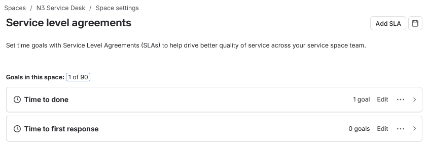
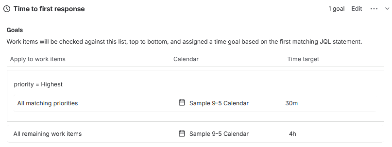
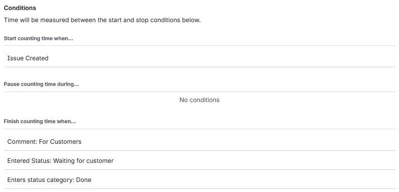
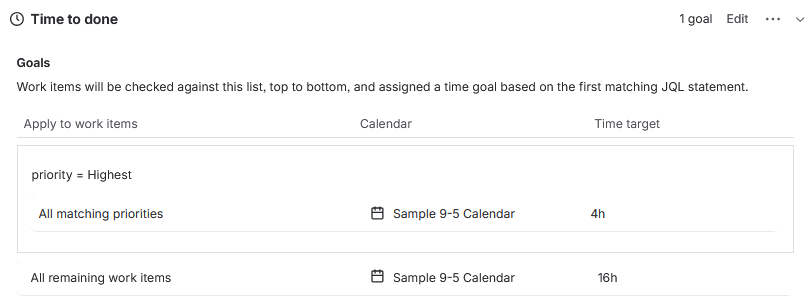
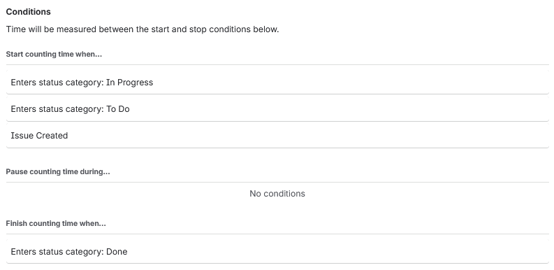
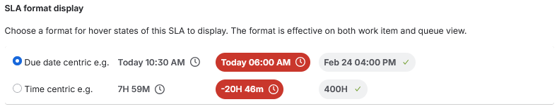
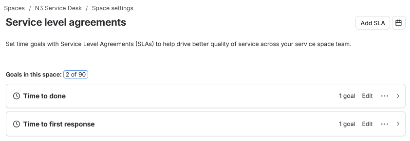

# SLA Field Setup

N3 uses Jira Service Management SLA goals to add response and completion targets to the ticket workflow.

This stage records the default SLA state, the configured first response target, the configured completion target, the SLA conditions, the display format, and the final SLA overview before live tickets are created.

## Work Path

| Step | Area                     | Action                                                          |
| ---- | ------------------------ | --------------------------------------------------------------- |
| 01   | Default SLA View         | Review the SLA goals created by the service space.              |
| 02   | First Response Goals     | Configure first response timing for highest and remaining work. |
| 03   | First Response Rules     | Set the conditions that stop the first response clock.          |
| 04   | Time to Done Goals       | Review completion targets for highest and remaining work.       |
| 05   | Time to Done Rules       | Confirm the conditions used to stop the completion clock.       |
| 06   | SLA Display              | Keep the due date centric SLA display.                          |
| 07   | Final SLA View           | Confirm both SLA goals are active.                              |

## Default SLA View

The service space opened with one existing SLA goal. `Time to done` already had one goal, while `Time to first response` had no goals configured.

The starting SLA state is shown in Figure 5.1.

*Figure 5.1 - Default SLA overview before first response was configured.*

## First Response Goals

`Time to first response` was configured to measure how quickly the first customer-facing response should be sent after a request is created.

Highest priority work was given a shorter target, while all remaining work items use a wider response window. Figure 5.2 shows the configured first response goals.

*Figure 5.2 - First response target set to 30 minutes for Highest priority and 4 hours for remaining work.*

| Work Item Match       | Calendar            | Target |
| --------------------- | ------------------- | ------ |
| `priority = Highest`  | Sample 9-5 Calendar | 30m    |
| All remaining work    | Sample 9-5 Calendar | 4h     |

## First Response Conditions

The first response timer starts when the issue is created.

The timer stops when a customer-facing comment is added, when the ticket enters `Waiting for customer`, or when the ticket reaches `Done`. This supports the ticket run because a ticket can be acknowledged through a direct customer update, paused for requester input, or closed if the issue is resolved immediately.

Figure 5.3 shows the first response conditions.

*Figure 5.3 - First response clock starting on issue creation and stopping on customer response, waiting status, or done status.*

| SLA Phase       | Condition                                      |
| --------------- | ---------------------------------------------- |
| Start counting  | Issue Created                                  |
| Pause counting  | No conditions                                  |
| Finish counting | Comment: For Customers                         |
| Finish counting | Entered Status: Waiting for customer           |
| Finish counting | Enters status category: Done                   |

## Done Time Goals

`Time to done` measures how quickly a ticket reaches completion.

The existing completion target was kept simple: Highest priority work has a shorter target, while all remaining work items use a longer 9-5 calendar target. Figure 5.4 shows the configured completion goals.

*Figure 5.4 - Time to done target set to 4 hours for Highest priority and 16 hours for remaining work.*

| Work Item Match       | Calendar            | Target |
| --------------------- | ------------------- | ------ |
| `priority = Highest`  | Sample 9-5 Calendar | 4h     |
| All remaining work    | Sample 9-5 Calendar | 16h    |

## Done Time Conditions

The completion timer starts when work is created or enters an active workflow state. It finishes when the ticket enters the `Done` status category.

Figure 5.5 shows the completion timer conditions.

*Figure 5.5 - Time to done clock ending when the ticket enters the Done status category.*

| SLA Phase       | Condition                            |
| --------------- | ------------------------------------ |
| Start counting  | Enters status category: In Progress  |
| Start counting  | Enters status category: To Do        |
| Start counting  | Issue Created                        |
| Pause counting  | No conditions                        |
| Finish counting | Enters status category: Done         |

## SLA Display

The SLA display was left as due date centric. This keeps SLA information readable in the work item and queue view by showing target due times and overdue states.

The selected display format is shown in Figure 5.6.

*Figure 5.6 - Due date centric SLA display used for ticket and queue visibility.*

## Final SLA View

After configuration, the SLA overview showed two active goals in the space: `Time to done` and `Time to first response`.

Figure 5.7 shows the final SLA overview.

*Figure 5.7 - Final SLA overview showing both SLA goals configured.*

## SLA Model

The SLA model is intentionally small so it supports ticket handling without turning the lab into a policy document.

| SLA                    | Highest Priority | Remaining Work | Purpose                                      |
| ---------------------- | ---------------- | -------------- | -------------------------------------------- |
| Time to first response | 30m              | 4h             | Measures first customer-facing response.     |
| Time to done           | 4h               | 16h            | Measures completion against the ticket flow. |

## Result

The N3 SLA model was configured with first response and completion targets.

The service desk now has request intake, queues, priority handling, and SLA visibility ready for the live ticket simulation.

## Navigation

| Previous                                               | Current            | Next                                                    |
| ------------------------------------------------------ | ------------------ | ------------------------------------------------------- |
| [04 Queue Priority Model](04-queue-priority-model.md)  | 05 SLA Field Setup | [06 Live Queue Simulation](06-live-queue-simulation.md) |