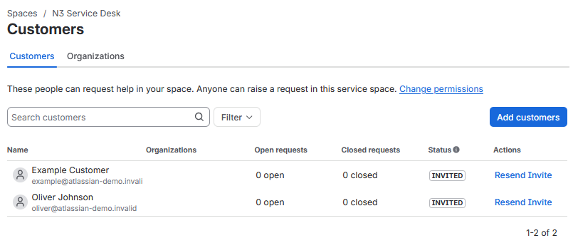
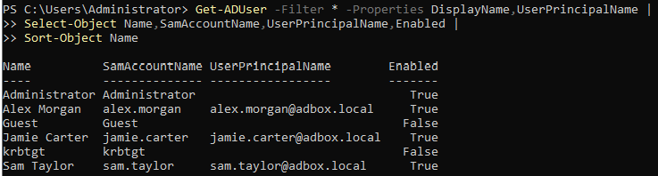
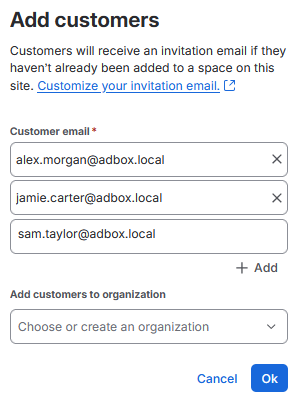
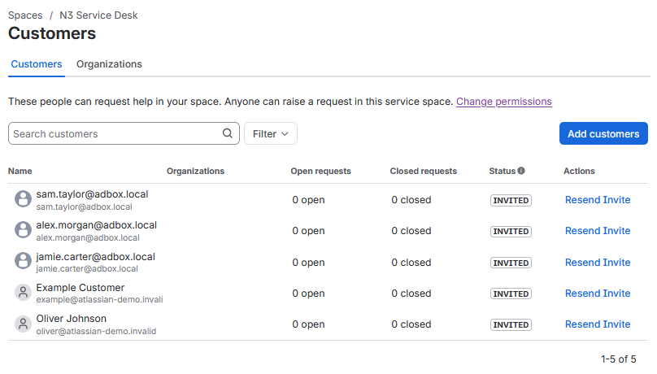
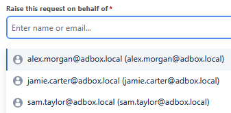

# Customer Account Records

N3 uses Jira customer records that match the enabled ADBox domain users used in the ticket scenarios.

This stage records the default Jira customer list, checks the live ADBox user accounts, creates matching Jira customer records, and confirms that those customers are available in the requester field before the live ticket run begins.

## Default Customer List

Before the ADBox-matched customer records were added, the Jira service space contained the default demo customers.

The starting customer list is shown in Figure 6.1.



*Figure 6.1 - Default Jira customer list before ADBox-matched customers were added.*

## ADBox User Account Check

The live ADBox user accounts were checked from PowerShell before matching Jira customer records were created.

### Work Path

```text
AD-SRV01 -> Win + R -> powershell -> Ctrl + Shift + Enter
```

### Run On

```text
AD-SRV01
```

```powershell
Get-ADUser -Filter * -Properties DisplayName,UserPrincipalName |
Select-Object Name,SamAccountName,UserPrincipalName,Enabled |
Sort-Object Name
```

### Command Breakdown

| Part                                          | Purpose                                                   |
| --------------------------------------------- | --------------------------------------------------------- |
| `Get-ADUser`                                  | Queries Active Directory user accounts.                   |
| `-Filter *`                                   | Returns all user accounts in the domain.                  |
| `-Properties DisplayName,UserPrincipalName`   | Includes display-name and UPN fields in the output.       |
| `Select-Object`                               | Limits the output to the fields needed for this check.    |
| `Name`                                        | Shows the account display name or account name.           |
| `SamAccountName`                              | Shows the domain username used with `ADBOX\username`.     |
| `UserPrincipalName`                           | Shows the email-style domain sign-in name.                |
| `Enabled`                                     | Shows whether the account is enabled for sign-in.         |
| `Sort-Object Name`                            | Orders the output by account name for easier review.      |

Figure 6.2 shows the ADBox account check.



*Figure 6.2 - Live ADBox users checked from PowerShell on AD-SRV01.*

The enabled ADBox user accounts selected for N3 customer records were:

| Display Name | SamAccountName | UserPrincipalName          |
| ------------ | -------------- | -------------------------- |
| Alex Morgan  | `alex.morgan`  | `alex.morgan@adbox.local`  |
| Jamie Carter | `jamie.carter` | `jamie.carter@adbox.local` |
| Sam Taylor   | `sam.taylor`   | `sam.taylor@adbox.local`   |

## Customer Account Creation

Customer records were added in Jira using the ADBox user principal names.

Figure 6.3 shows the three ADBox-matched customer addresses entered into the customer creation dialog.



*Figure 6.3 - ADBox user principal names added as Jira customer records.*

The customer records added were:

| Jira Customer Record         | Matching ADBox Account |
| ---------------------------- | ---------------------- |
| `alex.morgan@adbox.local`    | `ADBOX\alex.morgan`    |
| `jamie.carter@adbox.local`   | `ADBOX\jamie.carter`   |
| `sam.taylor@adbox.local`     | `ADBOX\sam.taylor`     |

These customer records provide realistic requester selection for the ticket simulation. The affected domain account, UPN, and workstation are still recorded inside each ticket so the Jira case stays tied to the ADBox account being tested.

## Customer List Confirmation

After the records were added, the customer list showed the three ADBox-matched customers alongside the existing default demo records.

Figure 6.4 shows the updated customer list.



*Figure 6.4 - Customer list showing the added ADBox-matched requester records.*

## Requester Selection Check

The request form was checked to confirm that the ADBox-matched customers could be selected when raising a service desk request.

Figure 6.5 shows the requester dropdown with the three added customer records available.



*Figure 6.5 - ADBox-matched customers available in the request requester field.*

## Result

The N3 service space now has Jira customer records that match the enabled ADBox domain users used in the ticket scenarios.

The next stage can start the live queue simulation with realistic requesters and ticket descriptions tied to the matching ADBox domain accounts.

## Navigation

| Previous                                    | Current                     | Next                                                    |
| ------------------------------------------- | --------------------------- | ------------------------------------------------------- |
| [05 SLA Field Setup](05-sla-field-setup.md) | 06 Customer Account Records | [07 Live Queue Simulation](07-live-queue-simulation.md) |