# Live Queue Simulation

N3 uses a staged ticket run to show how Jira Service Management handles intake, triage, priority movement, SLA visibility, customer replies, and queue routing during an active support session.

This stage creates ten Jira tickets across several request types. The tickets are not closed in this report because the technical investigations and fixes are recorded separately in the individual ticket records.

## Work Path

| Step | Area                  | Action                                                         |
| ---- | --------------------- | -------------------------------------------------------------- |
| 01   | Queue Start           | Confirm the `New and untriaged` queue starts empty.            |
| 02   | First Ticket          | Raise the first sign-in request and confirm queue entry.       |
| 03   | First Triage          | Assign the first ticket, raise its priority, and start work.   |
| 04   | Second Wave           | Add three more requests and confirm queue grouping.            |
| 05   | Third Wave            | Add a higher-impact domain resource issue during active work.  |
| 06   | First Response        | Send a customer-facing update and confirm SLA response state.  |
| 07   | User Wait             | Move a ticket into `Pending` after requesting more detail.     |
| 08   | Fourth Wave           | Add more medium-priority work and confirm category queues.     |
| 09   | Final Wave            | Add the last three tickets and confirm the end-session queue.  |

## Starting Queue State

The live queue simulation started from an empty `New and untriaged` queue, as shown in Figure 7.1.

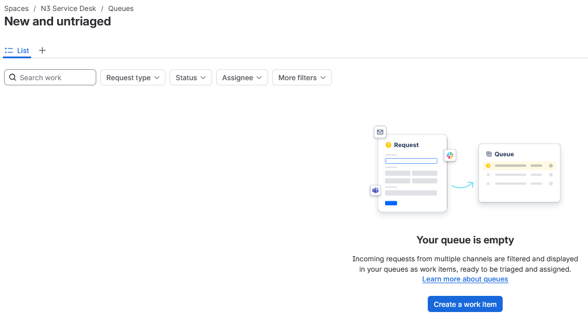

*Figure 7.1 - New and untriaged queue before the first ticket was raised.*

## Wave 1 - First Intake

The first request was raised as a `Cannot sign in` ticket for Alex Morgan on `AD-WIN10-01`.

Figure 7.2 shows the request form before submission.

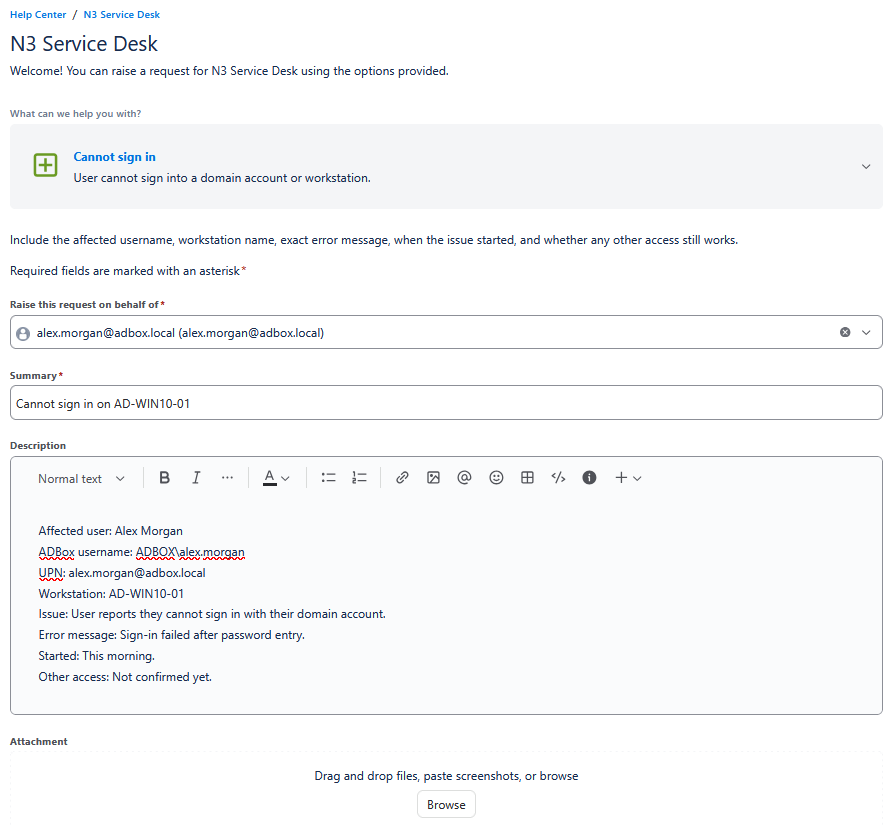

*Figure 7.2 - First customer request entered through the portal form.*

After submission, Jira created ticket `N3-1`, shown in Figure 7.3.

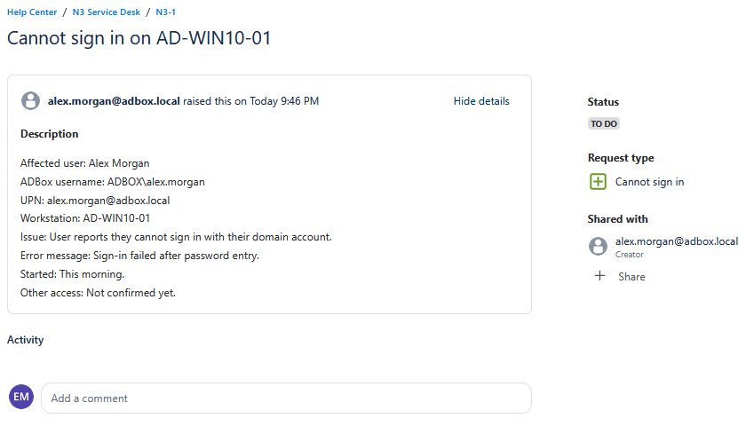

*Figure 7.3 - Created request view for N3-1.*

The ticket then appeared in `New and untriaged`, as shown in Figure 7.4.

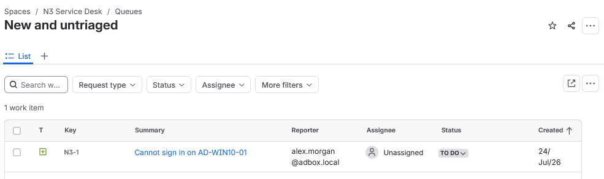

*Figure 7.4 - N3-1 entering the untriaged queue as an unassigned To Do item.*

## Wave 1 - First Triage

Before triage, `N3-1` was still unassigned, set to `Medium`, and sitting in `To Do`. The SLA panel was visible on the agent view.

Figure 7.5 shows the pre-triage state.

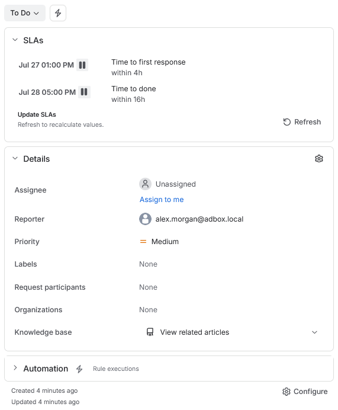

*Figure 7.5 - N3-1 before assignment, priority change, and workflow movement.*

The ticket was then assigned, raised to `High`, and moved to `In Progress`. This was appropriate because one named user could not sign in to the workstation, but the issue was not yet a full domain outage.

Figure 7.6 shows the triaged state.

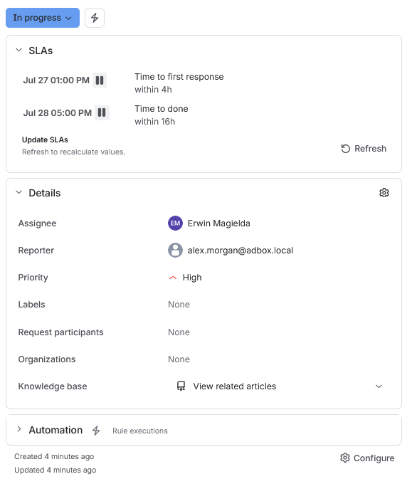

*Figure 7.6 - N3-1 assigned, raised to High priority, and moved into progress.*

After triage, `N3-1` appeared in the `High priority active` queue, shown in Figure 7.7.

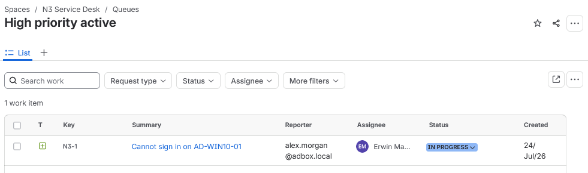

*Figure 7.7 - High priority active queue showing N3-1 after triage.*

## Wave 2 - Multiple Tickets

The second wave added three more tickets while `N3-1` was already active.

| Ticket | Summary                                           | Reporter                    | Request Type                  |
| ------ | ------------------------------------------------- | --------------------------- | ----------------------------- |
| N3-2   | Cannot access shared folder from AD-WIN10-01      | `jamie.carter@adbox.local`  | Shared folder access issue    |
| N3-3   | Remote Desktop connection fails to AD-WIN10-01    | `alex.morgan@adbox.local`   | Remote Desktop issue          |
| N3-4   | Account keeps locking after sign-in attempts      | `sam.taylor@adbox.local`    | Account locked                |

Figure 7.8 shows the three second-wave tickets entering `New and untriaged`.

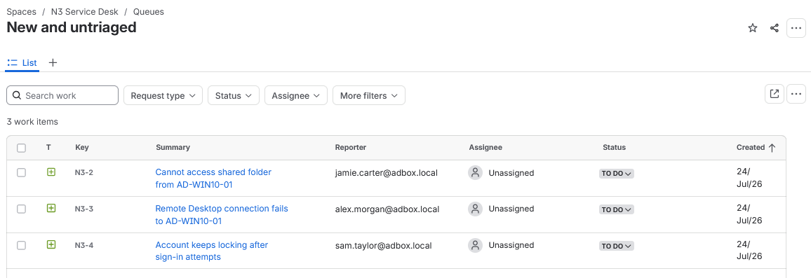

*Figure 7.8 - N3-2, N3-3, and N3-4 arriving as unassigned To Do tickets.*

After triage, all four open tickets were assigned. `N3-4` was moved into progress because an account lockout blocks the user from normal sign-in.

Figure 7.9 shows the second-wave triage result.

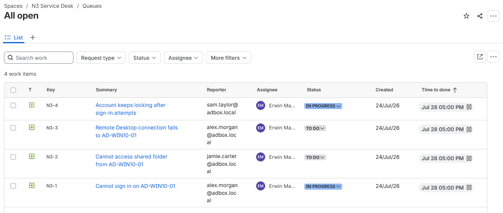

*Figure 7.9 - Wave 2 tickets assigned and triaged with mixed active and queued states.*

The high-priority queue then showed `N3-1` and `N3-4`, as shown in Figure 7.10.

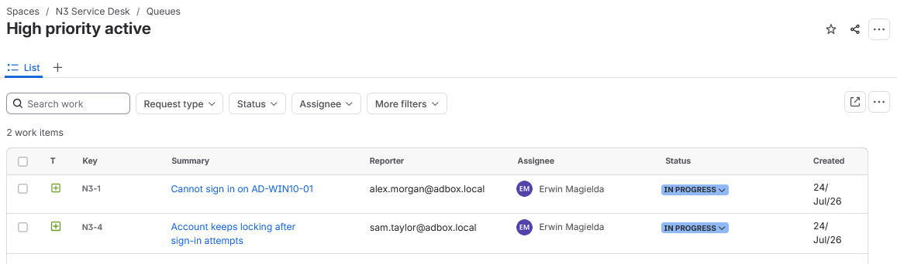

*Figure 7.10 - High priority active queue after Wave 2 triage.*

The identity and access queue grouped the sign-in, shared folder, and lockout work together.

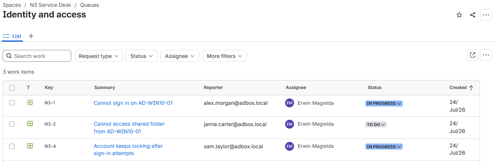

*Figure 7.11 - Identity and access queue after Wave 2.*

The network and endpoint queue separated the Remote Desktop issue into its own technical category view.

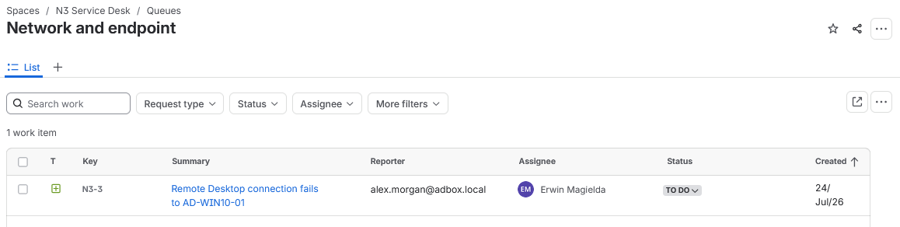

*Figure 7.12 - Network and endpoint queue after Wave 2.*

## Wave 3 - Higher-Impact Issue

The third wave added `N3-5`, a higher-impact domain resource ticket, while other work was already active.

| Ticket | Summary                                                     | Reporter                    | Request Type                       |
| ------ | ----------------------------------------------------------- | --------------------------- | ---------------------------------- |
| N3-5   | Cannot reach AD-SRV01 domain resources from AD-WIN10-01     | `jamie.carter@adbox.local`  | Network or domain resource issue   |

Figure 7.13 shows `N3-5` arriving in the untriaged queue.

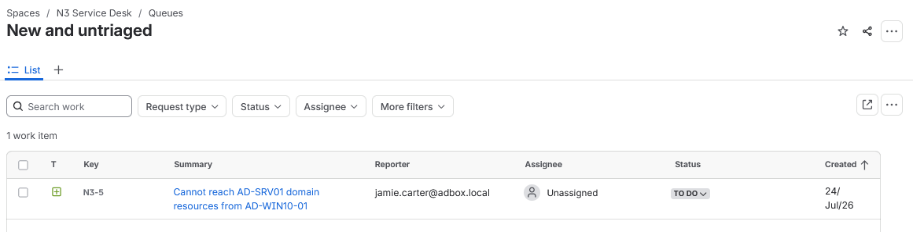

*Figure 7.13 - N3-5 entering the queue during an active support session.*

`N3-5` was triaged as `Highest`, assigned, and moved into progress. The SLA panel changed to the shorter highest-priority targets.

Figure 7.14 shows the triaged ticket state.

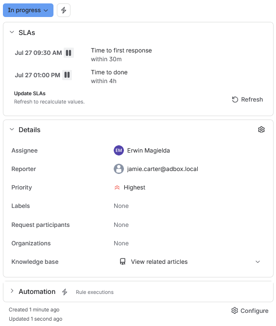

*Figure 7.14 - N3-5 assigned, moved into progress, and raised to Highest priority.*

After triage, `N3-5` appeared at the top of `High priority active`, above the existing high-priority tickets.

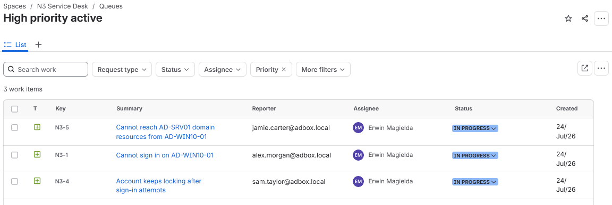

*Figure 7.15 - Highest-priority domain resource issue moved ahead of earlier active work.*

## SLA Check

A customer-facing reply was sent on `N3-5` to acknowledge the highest-priority ticket and start the update path.

Figure 7.16 shows the response being entered.

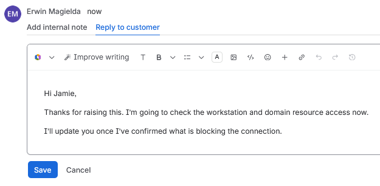

*Figure 7.16 - Customer-facing first response prepared for N3-5.*

After the response was sent, the SLA panel showed the first response SLA completed while the time-to-done SLA remained active.

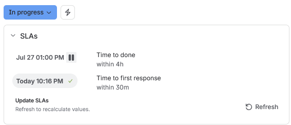

*Figure 7.17 - First response SLA completed on the highest-priority ticket.*

## User Wait

`N3-2` was used to test the `Waiting on user` queue. A customer-facing reply asked Jamie Carter to confirm the exact shared folder path and when the access denied message appeared.

Figure 7.18 shows the reply.

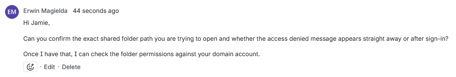

*Figure 7.18 - Customer reply requesting missing shared folder detail.*

After the reply, the ticket was moved to `Pending`. The SLA panel showed the first response completed while the completion target remained active.

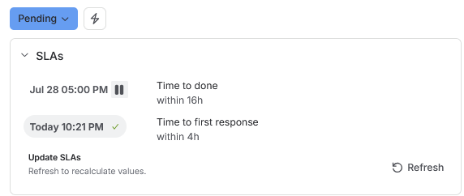

*Figure 7.19 - N3-2 moved to Pending with first response recorded.*

The ticket then appeared in the `Waiting on user` queue.

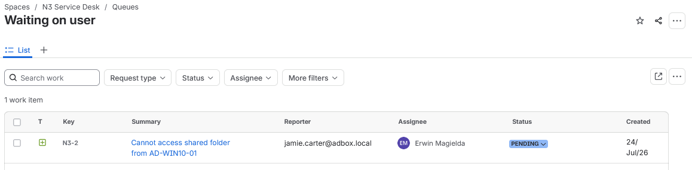

*Figure 7.20 - Waiting on user queue showing N3-2 in Pending.*

## Wave 4 - Additional Work

The fourth wave added two more tickets after the queue already contained active, pending, and normal-priority work.

| Ticket | Summary                                        | Reporter                   | Request Type                  |
| ------ | ---------------------------------------------- | -------------------------- | ----------------------------- |
| N3-6   | Expected desktop policy missing on AD-WIN10-01 | `sam.taylor@adbox.local`   | Workstation or policy issue   |
| N3-7   | Request access to Support                      | `alex.morgan@adbox.local`  | Access request                |

Figure 7.21 shows both tickets entering `New and untriaged`.

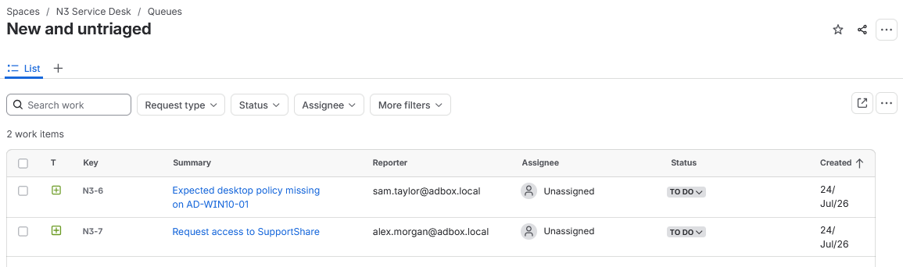

*Figure 7.21 - N3-6 and N3-7 arriving as fourth-wave tickets.*

After triage, the queue contained seven open tickets across `In Progress`, `Pending`, and `To Do`.

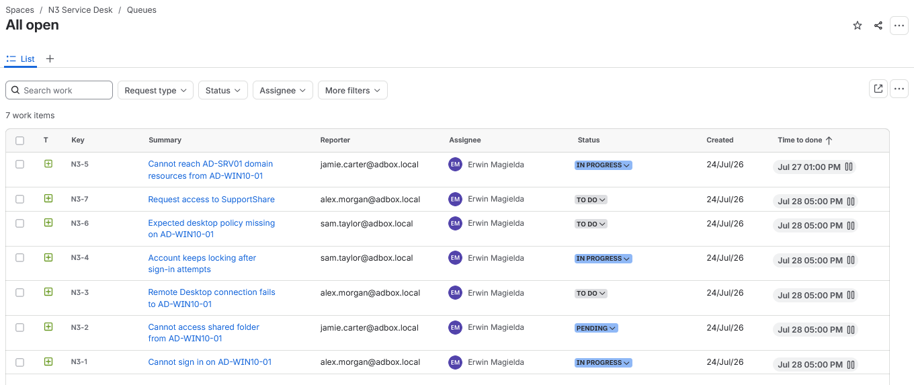

*Figure 7.22 - All open queue after Wave 4 triage.*

The network and endpoint queue grouped the Remote Desktop, domain resource, and workstation policy issues.

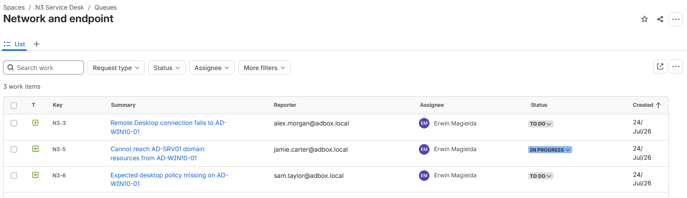

*Figure 7.23 - Network and endpoint queue after Wave 4.*

The identity and access queue grouped sign-in, shared folder, lockout, and access request work.

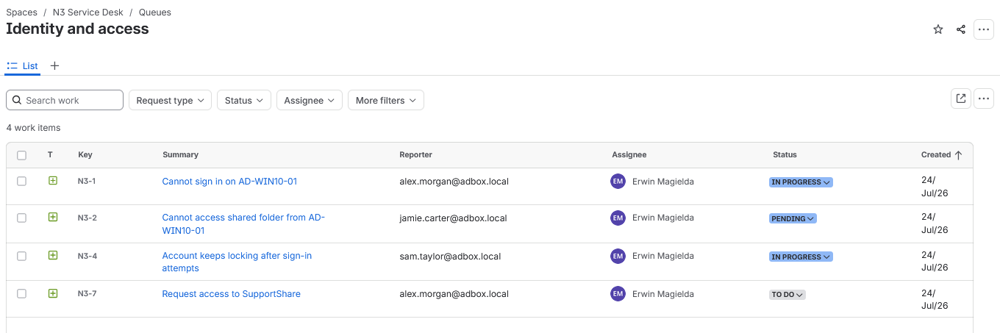

*Figure 7.24 - Identity and access queue after Wave 4.*

## Final Wave - Queue State

The final wave added the last three tickets, bringing the simulation to ten total requests.

| Ticket | Summary                                   | Reporter                    | Request Type                       |
| ------ | ----------------------------------------- | --------------------------- | ---------------------------------- |
| N3-8   | Cannot sign in after password reset       | `sam.taylor@adbox.local`    | Cannot sign in                     |
| N3-9   | Domain name lookup fails on AD-WIN10-01   | `alex.morgan@adbox.local`   | Network or domain resource issue   |
| N3-10  | Request Remote Desktop access for support | `jamie.carter@adbox.local`  | Access request                     |

Figure 7.25 shows the final wave entering `New and untriaged`.

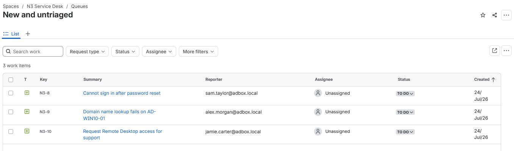

*Figure 7.25 - N3-8, N3-9, and N3-10 entering the untriaged queue.*

After final triage, all ten tickets were visible in `All open`.

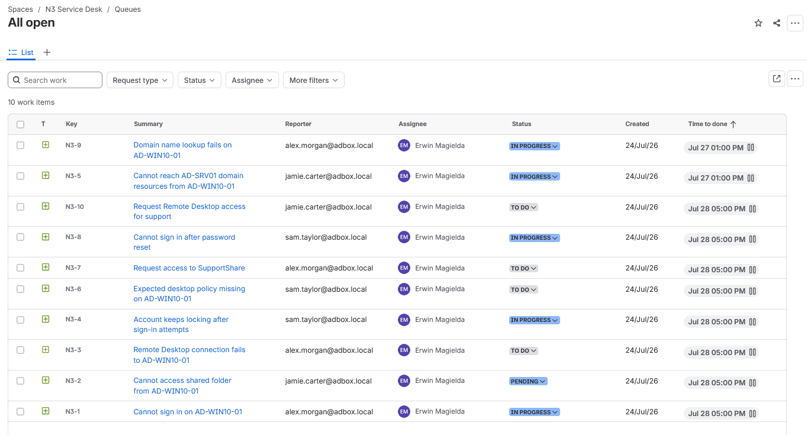

*Figure 7.26 - All open queue after all ten tickets were raised and triaged.*

The final high-priority queue showed the active tickets that would be handled first during the next technical investigation stage.

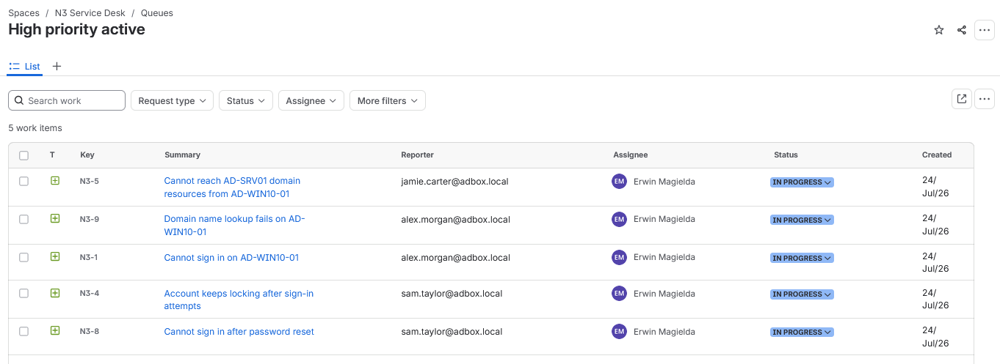

*Figure 7.27 - High priority active queue at the end of the live queue simulation.*

## End-State Summary

The queue simulation ended at a triage checkpoint.

| Ticket | Summary                                                 | End Status  | Queue Role                         |
| ------ | ------------------------------------------------------- | ----------- | ---------------------------------- |
| N3-1   | Cannot sign in on AD-WIN10-01                           | In Progress | High-priority active work          |
| N3-2   | Cannot access shared folder from AD-WIN10-01            | Pending     | Waiting on user                    |
| N3-3   | Remote Desktop connection fails to AD-WIN10-01          | To Do       | Network and endpoint backlog       |
| N3-4   | Account keeps locking after sign-in attempts            | In Progress | High-priority active work          |
| N3-5   | Cannot reach AD-SRV01 domain resources from AD-WIN10-01 | In Progress | Highest-priority active work       |
| N3-6   | Expected desktop policy missing on AD-WIN10-01          | To Do       | Network and endpoint backlog       |
| N3-7   | Request access to SupportShare                          | To Do       | Identity and access backlog        |
| N3-8   | Cannot sign in after password reset                     | In Progress | High-priority active work          |
| N3-9   | Domain name lookup fails on AD-WIN10-01                 | In Progress | Highest-priority active work       |
| N3-10  | Request Remote Desktop access for support               | To Do       | Identity and access backlog        |

## Result

The N3 service desk processed a ten-ticket live queue simulation across multiple request types.

The run confirmed customer intake, queue entry, assignment, priority escalation, category queue routing, first-response SLA behaviour, and the `Waiting on user` flow. Tickets were left open at the triage checkpoint because the technical checks, fixes, evidence, and closure notes are recorded in the individual ticket records.

## Navigation

| Previous                                                      | Current                  | Next                                                        |
| ------------------------------------------------------------- | ------------------------ | ----------------------------------------------------------- |
| [06 Customer Account Records](06-customer-account-records.md) | 07 Live Queue Simulation | [08 Knowledge Base Handover](08-knowledge-base-handover.md) |