# N3-1 // Cannot Sign In

## Ticket Summary

This ticket was raised through the N3 Jira Service Management portal as part of the live queue simulation.

| Field             | Value                                      |
| ----------------- | ------------------------------------------ |
| Jira Key          | N3-1                                       |
| Request Type      | Cannot sign in                             |
| Reporter          | `alex.morgan@adbox.local`                  |
| Affected User     | Alex Morgan                                |
| ADBox Account     | `ADBOX\alex.morgan`                        |
| UPN               | `alex.morgan@adbox.local`                  |
| Workstation       | `AD-WIN10-01`                              |
| Starting Priority | High                                       |
| Starting Status   | In Progress                                |
| Final Status      | Done                                       |

## Reported Issue

Alex Morgan reported that they could not sign in to `AD-WIN10-01` with their domain account.

The Jira ticket recorded the affected user, ADBox username, UPN, workstation, reported error message, and whether other access had been confirmed.

Figure 1 shows the ticket details captured from Jira.

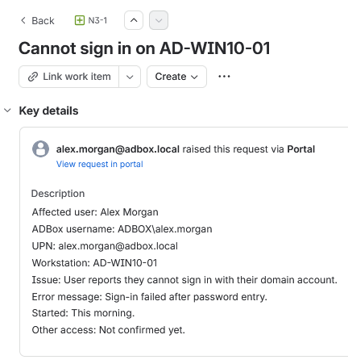

*Figure 1 - Jira ticket details for the reported sign-in issue.*

## Triage

The ticket was treated as a high priority user access issue because the affected user could not sign in to the assigned workstation.

| Area      | Value                                                      |
| --------- | ---------------------------------------------------------- |
| Impact    | User unable to access `AD-WIN10-01` with domain account.   |
| Urgency   | High, workstation sign-in was blocked.                     |
| Priority  | High                                                       |
| Queue     | Identity and access                                        |
| Owner     | Erwin Magielda                                             |

## Investigation

The sign-in failure was confirmed from `AD-WIN10-01`.

The Windows sign-in screen showed that Alex Morgan's account had been disabled, which matched an account-state issue instead of a password typo or workstation-only fault.

Figure 2 shows the client-side sign-in failure.

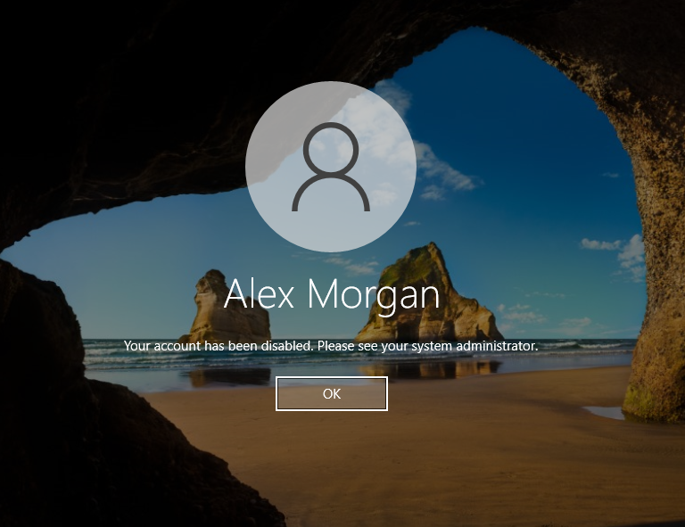

*Figure 2 - AD-WIN10-01 showing the disabled-account message for Alex Morgan.*

The affected account was then checked in Active Directory Users and Computers on `AD-SRV01`.

The Account tab showed that `Account is disabled` was selected.

Figure 3 shows the account properties view.

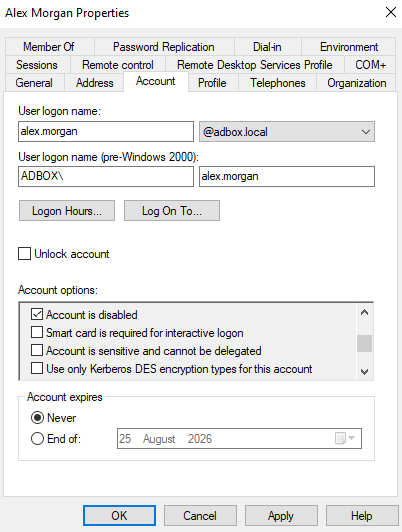

*Figure 3 - Alex Morgan account properties showing the disabled account state.*

Figure 4 shows the disabled account option more closely.

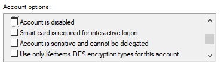

*Figure 4 - `Account is disabled` selected for `alex.morgan`.*

PowerShell was also used to confirm the same account state from the command line.

```powershell
Get-ADUser alex.morgan -Properties Enabled |
Select-Object Name,SamAccountName,Enabled
```

| Part                     | Purpose                                      |
| ------------------------ | -------------------------------------------- |
| `Get-ADUser alex.morgan` | Queries the affected ADBox user account.     |
| `-Properties Enabled`    | Includes the enabled or disabled state.      |
| `Select-Object`          | Limits the output to the required fields.    |
| `Name`                   | Shows the display name.                      |
| `SamAccountName`         | Shows the AD username.                       |
| `Enabled`                | Shows whether the account can sign in.       |

The command returned `Enabled = False`, confirming that the account was disabled in both ADUC and PowerShell.

Figure 5 shows the PowerShell disabled-state check.

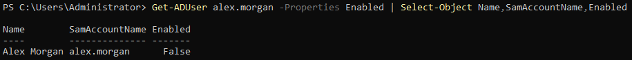

*Figure 5 - PowerShell confirming that `alex.morgan` was disabled.*

## Finding

The issue was caused by the `alex.morgan` Active Directory account being disabled.

| Check               | Result                              |
| ------------------- | ----------------------------------- |
| Client sign-in      | Disabled-account message displayed. |
| ADUC Account tab    | `Account is disabled` selected.     |
| PowerShell check    | `Enabled = False`.                  |
| Root cause          | Disabled AD account.                |

## Resolution Applied

The account was enabled from Active Directory Users and Computers using the right-click `Enable Account` option.

Figure 6 shows the GUI enablement action.

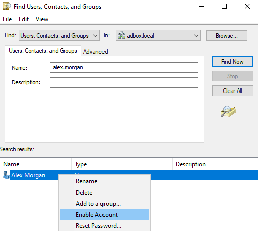

*Figure 6 - Enable Account option available for Alex Morgan in ADUC.*

PowerShell was also documented as an equivalent command-line method for enabling the account.

```powershell
Enable-ADAccount -Identity alex.morgan
```

| Part                           | Purpose                              |
| ------------------------------ | ------------------------------------ |
| `Enable-ADAccount`             | Enables an Active Directory account. |
| `-Identity alex.morgan`        | Targets the affected ADBox user.     |

Figure 7 shows the PowerShell enablement command.


*Figure 7 - PowerShell enablement command for `alex.morgan`.*

## Alternative Admin Methods

The disabled account could be enabled through several valid administrative methods.

| Method            | Action                                      | Use                                                       |
| ----------------- | ------------------------------------------- | --------------------------------------------------------- |
| ADUC Account tab  | Untick `Account is disabled`.               | Useful when already reviewing the user properties.        |
| ADUC context menu | Right-click user -> `Enable Account`.       | Fast GUI method from the user object or search result.    |
| PowerShell        | `Enable-ADAccount -Identity alex.morgan`.   | Repeatable command-line method for administrative fixes.  |

The GUI context-menu method was used as the primary support action for this ticket. PowerShell was used to confirm the account state and document the equivalent command-line method.

## PowerShell Validation

The account state was checked again after enablement.

```powershell
Get-ADUser alex.morgan -Properties Enabled |
Select-Object Name,SamAccountName,Enabled
```

The command returned `Enabled = True`, confirming that the account had been enabled.

Figure 8 shows the post-fix PowerShell validation.

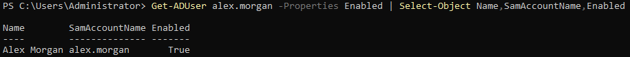

*Figure 8 - PowerShell confirming that `alex.morgan` was enabled after the fix.*

## Client Validation

Sign-in was confirmed from the affected workstation after the account was enabled.

The validation used a local client session because the reported issue involved interactive domain sign-in on `AD-WIN10-01`.

```cmd
whoami
hostname
ipconfig /all
```

| Check      | Result              |
| ---------- | ------------------- |
| `whoami`   | `adbox\alex.morgan` |
| `hostname` | `AD-WIN10-01`       |
| DNS suffix | `adbox.local`       |

Figure 9 shows the client-side validation.

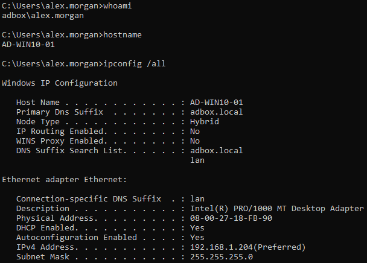

*Figure 9 - AD-WIN10-01 signed in as `adbox\alex.morgan` after the account was enabled.*

## Jira Notes

An internal note was added to the ticket to record the technical finding, fix, and validation.

Figure 10 shows the internal note.

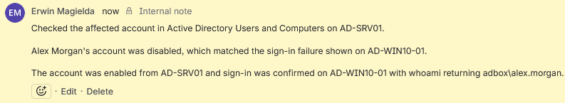

*Figure 10 - Internal note recording the AD account check, account enablement, and client validation.*

A customer-facing reply was sent to explain the fix in plain language.

Figure 11 shows the customer reply.

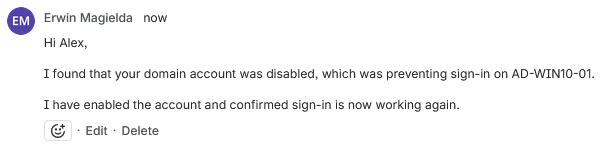

*Figure 11 - Customer reply confirming that sign-in was working again.*

## Closure

The ticket was moved to `Done` after the disabled account was enabled, PowerShell confirmed the account state, sign-in was validated from `AD-WIN10-01`, and the customer was updated.

Figure 12 shows the final Jira state.

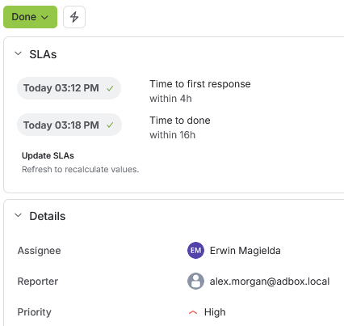

*Figure 12 - N3-1 closed with first response and time to done SLAs completed.*

## Result

N3-1 was resolved by identifying that `ADBOX\alex.morgan` was disabled in Active Directory.

The disabled state was confirmed through both ADUC and PowerShell. The account was enabled through the ADUC context menu, PowerShell confirmed that the account state changed to `Enabled = True`, sign-in was validated from `AD-WIN10-01`, the Jira ticket was updated internally, the customer was informed, and the ticket was closed.