# N3-2 // Cannot Access Shared Folder

## Ticket Summary

This ticket was raised through the N3 Jira Service Management portal as part of the live queue simulation.

| Field             | Value                                      |
| ----------------- | ------------------------------------------ |
| Jira Key          | N3-2                                       |
| Request Type      | Shared folder access issue                 |
| Reporter          | `jamie.carter@adbox.local`                 |
| Affected User     | Jamie Carter                               |
| ADBox Account     | `ADBOX\jamie.carter`                       |
| UPN               | `jamie.carter@adbox.local`                 |
| Workstation       | `AD-WIN10-01`                              |
| Submitted Path    | `\\AD-SRV01\Support`                       |
| Confirmed Path    | `\\AD-SRV01\Sales`                         |
| Starting Priority | Medium                                     |
| Starting Status   | Pending                                    |
| Final Status      | Done                                       |

## Reported Issue

Jamie Carter reported that they could not open a shared folder from `AD-WIN10-01`.

The submitted ticket referenced `\\AD-SRV01\Support`, included an access denied error, and stated that the user believed access had worked before.

Figure 1 shows the original ticket details captured from Jira.

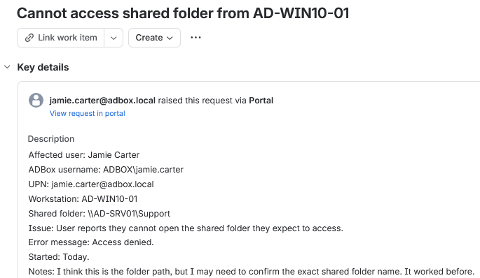

*Figure 1 - Jira ticket details for the reported shared folder access issue.*

## Triage

The ticket was placed in `Pending` while the exact shared folder path was clarified.

The submitted path needed confirmation before changing permissions or group membership. After the target folder was confirmed as `\\AD-SRV01\Sales`, the ticket was investigated as a Sales share access issue.

| Area      | Value                                                                |
| --------- | -------------------------------------------------------------------- |
| Impact    | User could not open the required `\\AD-SRV01\Support` shared folder. |
| Urgency   | Medium, folder access was blocked but workstation sign-in worked.    |
| Priority  | Medium                                                               |
| Queue     | Identity and access                                                  |
| Owner     | Erwin Magielda                                                       |

## Investigation

Access to `\\AD-SRV01\Sales` was tested from `AD-WIN10-01`.

The Windows network error showed that Jamie Carter did not have permission to access the Sales share.

Figure 2 shows the client-side access failure.

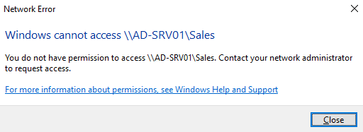

*Figure 2 - AD-WIN10-01 showing access denied for `\\AD-SRV01\Sales`.*

The affected account was then checked in Active Directory Users and Computers on `AD-SRV01`.

Jamie Carter's `Member Of` tab showed that the account was not a member of `GG_Sales_Users`, the access group used for the Sales shared folder.

Figure 3 shows the missing group membership.

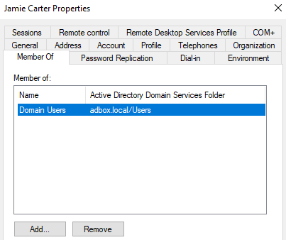

*Figure 3 - Jamie Carter missing the `GG_Sales_Users` group membership.*

PowerShell was also used to check the same account membership from the command line.

```powershell
Get-ADPrincipalGroupMembership jamie.carter | Select-Object Name
```

| Part                                      | Purpose                                           |
| ----------------------------------------- | ------------------------------------------------- |
| `Get-ADPrincipalGroupMembership`          | Lists the AD groups assigned to the account.      |
| `jamie.carter`                            | Targets the affected ADBox user.                  |
| Pipeline to `Select-Object`               | Sends the group objects into the output selector. |
| `Name`                                    | Shows only the group names.                       |

The output did not include `GG_Sales_Users`, confirming that the account was missing the required Sales access group in both ADUC and PowerShell.

Figure 4 shows the missing membership check.

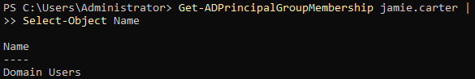

*Figure 4 - PowerShell output showing `jamie.carter` was not a member of `GG_Sales_Users`.*

## Finding

The issue was caused by Jamie Carter missing the required Sales share access group membership.

| Check                 | Result                                           |
| --------------------- | ------------------------------------------------ |
| Client access test    | Access denied for `\\AD-SRV01\Sales`.            |
| ADUC membership check | `GG_Sales_Users` missing from `Member Of`.        |
| PowerShell check      | `GG_Sales_Users` missing from group output.       |
| Root cause            | Missing Sales share access group membership.      |

## Resolution Applied

Jamie Carter was added to `GG_Sales_Users` from Active Directory Users and Computers.

The primary support action used the affected user's `Member Of` tab because the investigation had already confirmed the missing membership from the user account properties.

Figure 5 shows the group selection dialog used to add `GG_Sales_Users`.

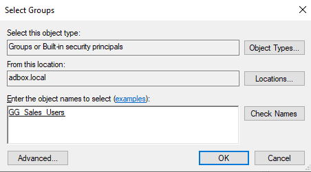

*Figure 5 - Adding `GG_Sales_Users` to Jamie Carter's group membership.*

Figure 6 shows Jamie Carter after the group was added.

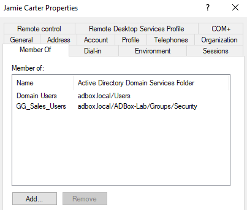

*Figure 6 - Jamie Carter added to `GG_Sales_Users`.*

## PowerShell Validation

PowerShell was used again after the ADUC fix to confirm that Jamie Carter was now a member of `GG_Sales_Users`.

```powershell
Get-ADPrincipalGroupMembership jamie.carter | Select-Object Name
```

The output included `GG_Sales_Users`, confirming that the required Sales share access group had been applied.

Figure 7 shows the post-fix PowerShell validation.

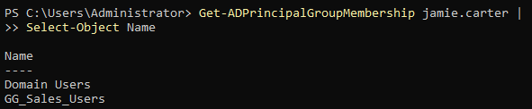

*Figure 7 - PowerShell confirming that `jamie.carter` is a member of `GG_Sales_Users`.*

## Client Validation

Jamie Carter signed back in to `AD-WIN10-01` after the group membership was updated.

Access to `\\AD-SRV01\Sales` was then tested again from the client workstation. The Sales share opened successfully and displayed the folder contents.

Figure 8 shows the successful client-side access test.

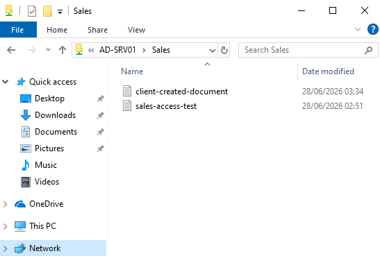

*Figure 8 - AD-WIN10-01 opening `\\AD-SRV01\Sales` successfully after the access fix.*

## Alternative Methods

The same group membership change could also be completed through other valid administrative methods.

| Method            | Action                                                      | Use                                                       |
| ----------------- | ----------------------------------------------------------- | --------------------------------------------------------- |
| ADUC User tab     | Add `GG_Sales_Users` from Jamie Carter's `Member Of` tab.   | Primary method used in this ticket.                       |
| ADUC Group tab    | Open `GG_Sales_Users` and add `jamie.carter` from `Members`. | Useful when managing access from the group object.        |
| PowerShell        | `Add-ADGroupMember -Identity "GG_Sales_Users" -Members "jamie.carter"`. | Repeatable command-line method for group membership changes. |

PowerShell was documented as an equivalent command-line method for adding the same group membership.

```powershell
Add-ADGroupMember -Identity "GG_Sales_Users" -Members "jamie.carter"
```

| Part                   | Purpose                                      |
| ---------------------- | -------------------------------------------- |
| `Add-ADGroupMember`    | Adds users, computers or groups to an AD group. |
| `-Identity`            | Specifies the target group.                  |
| `GG_Sales_Users`       | The Sales share access group.                |
| `-Members`             | Specifies the account being added.           |
| `jamie.carter`         | The affected ADBox user account.             |

Figure 9 shows the PowerShell group-add method.

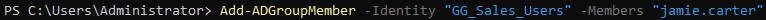

*Figure 9 - Alternative PowerShell method for adding `jamie.carter` to `GG_Sales_Users`.*

## Jira Notes

The Jira activity recorded the clarification, technical finding, fix, validation, and customer update.

An internal note was added to explain that the path had been clarified, access to `\\AD-SRV01\Sales` returned access denied, Jamie Carter was missing `GG_Sales_Users`, and the account was added to the required group.

Figure 10 shows the internal note.

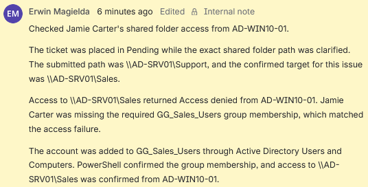

*Figure 10 - Internal note recording the path clarification, missing group membership, fix, and validation.*

A customer-facing reply was sent to confirm the access update in plain language.

Figure 11 shows the customer reply.

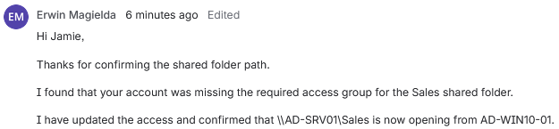

*Figure 11 - Customer reply confirming that the Sales shared folder was opening again.*

## Closure

The ticket was moved to `Done` after the required group membership was added, PowerShell confirmed the account membership, access was validated from `AD-WIN10-01`, and the customer was updated.

Figure 12 shows the final Jira state.

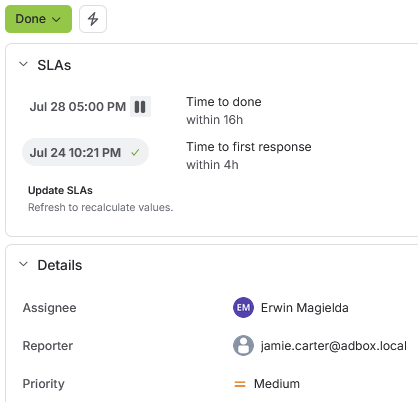

*Figure 12 - N3-2 closed after the Sales shared folder access issue was resolved.*

## Result

N3-2 was resolved by identifying that `ADBOX\jamie.carter` was missing the required `GG_Sales_Users` membership for the Sales shared folder.

The ticket was first held in `Pending` while the exact shared folder path was clarified. After the target folder was confirmed as `\\AD-SRV01\Sales`, access failure was reproduced from `AD-WIN10-01`, missing group membership was confirmed in both ADUC and PowerShell, Jamie Carter was added to `GG_Sales_Users`, PowerShell confirmed the updated membership, client access was validated, the Jira ticket was updated, the customer was informed, and the ticket was closed.