# N3-3 // Remote Desktop Connection Fails

## Ticket Summary

This ticket was raised through the N3 Jira Service Management portal as part of the live queue simulation.

| Field             | Value                                      |
| ----------------- | ------------------------------------------ |
| Jira Key          | N3-3                                       |
| Request Type      | Remote Desktop issue                       |
| Reporter          | `alex.morgan@adbox.local`                  |
| Affected User     | Alex Morgan                                |
| ADBox Account     | `ADBOX\alex.morgan`                        |
| UPN               | `alex.morgan@adbox.local`                  |
| Workstation       | `AD-WIN10-01`                              |
| Target Device     | `AD-WIN10-01`                              |
| Starting Priority | Medium                                     |
| Starting Status   | To Do                                      |
| Final Status      | Done                                       |

## Reported Issue

Alex Morgan reported that Remote Desktop support could not connect to `AD-WIN10-01`.

The ticket recorded the affected user, ADBox username, UPN, workstation, target device, reported Remote Desktop error, and a note that the workstation could still be used locally.

Figure 1 shows the ticket details captured from Jira.

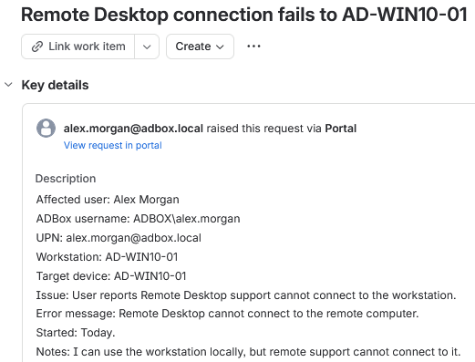

*Figure 1 - Jira ticket details for the reported Remote Desktop connection issue.*

## Triage

The ticket was treated as a medium-priority remote support issue because the workstation was still usable locally, but support could not connect remotely.

| Area     | Value                                                              |
| -------- | ------------------------------------------------------------------ |
| Impact   | Remote support could not connect to `AD-WIN10-01`.                 |
| Urgency  | Medium, local workstation use was still available.                 |
| Priority | Medium                                                             |
| Queue    | Network and endpoint                                               |
| Owner    | Erwin Magielda                                                     |

## Investigation

Remote Desktop Connection was tested from the support side against `AD-WIN10-01`.

The connection failed with the standard Remote Desktop message stating that the remote computer could not be reached or remote access was not enabled.

Figure 2 shows the Remote Desktop connection failure.

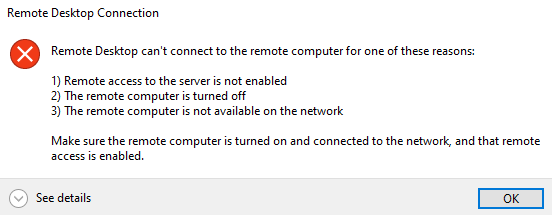

*Figure 2 - Remote Desktop failing to connect to `AD-WIN10-01`.*

Because Remote Desktop configuration is a workstation-level setting, the check was performed from an administrator session on `AD-WIN10-01`.

Figure 3 shows the administrator account available on the workstation sign-in screen.

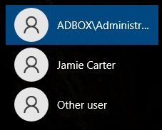

*Figure 3 - Administrator account used for the workstation-level configuration check.*

Remote Desktop was checked in Windows Settings and was found disabled.

Figure 4 shows the disabled Remote Desktop setting.

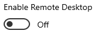

*Figure 4 - Remote Desktop disabled on `AD-WIN10-01`.*

PowerShell was also used to confirm the same setting from the registry.

```powershell
Get-ItemProperty -Path "HKLM:\SYSTEM\CurrentControlSet\Control\Terminal Server" |
Select-Object fDenyTSConnections
```

| Part                                  | Purpose                                                   |
| ------------------------------------- | --------------------------------------------------------- |
| `Get-ItemProperty`                    | Reads a registry path or object property.                 |
| `HKLM:\SYSTEM\...\Terminal Server`   | Targets the Windows Remote Desktop configuration key.     |
| `Select-Object fDenyTSConnections`    | Shows the setting that controls whether RDP is denied.    |

The value `fDenyTSConnections = 1` confirmed that Remote Desktop connections were denied.

Figure 5 shows the PowerShell check before the fix.

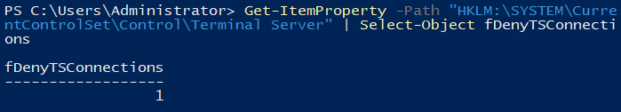

*Figure 5 - PowerShell confirming that Remote Desktop connections were denied.*

## Finding

The issue was caused by Remote Desktop being disabled on `AD-WIN10-01`.

| Check                    | Result                                                  |
| ------------------------ | ------------------------------------------------------- |
| RDP connection test      | Remote Desktop could not connect to `AD-WIN10-01`.      |
| Windows Settings         | Remote Desktop was disabled.                            |
| PowerShell check         | `fDenyTSConnections = 1`.                                |
| Root cause               | Remote Desktop connections were denied on the workstation. |

## Resolution Applied

Remote Desktop was enabled from an administrator session on `AD-WIN10-01`.

This was the primary support action because the issue was a workstation Remote Desktop configuration fault, not an Alex Morgan account permission issue.

Figure 6 shows the Remote Desktop enablement confirmation dialog.

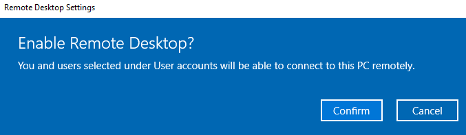

*Figure 6 - Windows confirmation dialog for enabling Remote Desktop.*

Figure 7 shows Remote Desktop enabled after the change.

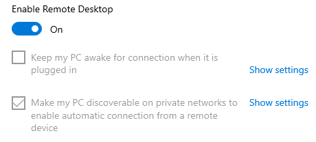

*Figure 7 - Remote Desktop enabled on `AD-WIN10-01`.*

## PowerShell Validation

PowerShell was used again after the GUI fix to confirm that Remote Desktop connections were allowed.

```powershell
Get-ItemProperty -Path "HKLM:\SYSTEM\CurrentControlSet\Control\Terminal Server" |
Select-Object fDenyTSConnections
```

The value changed to `fDenyTSConnections = 0`, confirming that Remote Desktop was enabled.

Figure 8 shows the post-fix PowerShell validation.

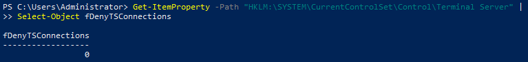

*Figure 8 - PowerShell confirming that Remote Desktop connections were allowed after the fix.*

## Client Validation

Remote Desktop Connection was tested again from the support side.

After Remote Desktop was enabled, the connection reached the Windows session handoff prompt for `ADBOX\Administrator`.

Figure 9 shows the session disconnect warning displayed before the administrator RDP session opened.

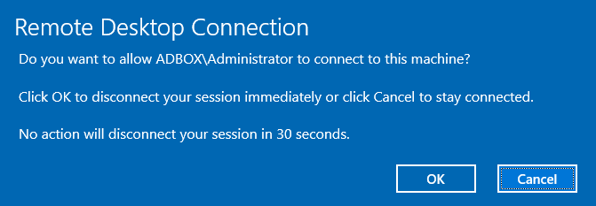

*Figure 9 - Windows warning that the local session would be disconnected for the administrator RDP session.*

The final validation was completed inside the remote session.

```cmd
hostname
whoami
query user
```

| Check        | Result                  |
| ------------ | ----------------------- |
| `hostname`   | `AD-WIN10-01`           |
| `whoami`     | `adbox\administrator`   |
| `query user` | Administrator active on `rdp-tcp#2`. |

The successful Remote Desktop validation used `ADBOX\Administrator` because this ticket concerned the workstation's Remote Desktop configuration, not Alex Morgan's permission to start an RDP session.

Figure 10 shows the confirmed administrator RDP session.

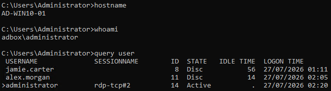

*Figure 10 - RDP session confirmed on `AD-WIN10-01` as `adbox\administrator`.*

## Alternative Methods

The same Remote Desktop configuration issue could also be resolved through other valid administrative methods.

| Method            | Action                                                                                     | Use                                                       |
| ----------------- | ------------------------------------------------------------------------------------------ | --------------------------------------------------------- |
| Windows Settings  | Enable Remote Desktop from `Settings -> System -> Remote Desktop`.                         | Primary method used in this ticket.                       |
| PowerShell        | Set `fDenyTSConnections` to `0` and enable the Remote Desktop firewall group.               | Repeatable command-line method for workstation fixes.     |
| System Properties | Enable Remote Desktop from the classic remote settings panel.                              | Useful on older Windows support workflows.                |

PowerShell can be used as an equivalent command-line method.

```powershell
Set-ItemProperty -Path "HKLM:\SYSTEM\CurrentControlSet\Control\Terminal Server" -Name fDenyTSConnections -Value 0
Enable-NetFirewallRule -DisplayGroup "Remote Desktop"
```

| Part                            | Purpose                                                   |
| ------------------------------- | --------------------------------------------------------- |
| `Set-ItemProperty`              | Changes a registry value.                                 |
| `fDenyTSConnections`            | Controls whether Remote Desktop connections are denied.   |
| `-Value 0`                      | Allows Remote Desktop connections.                        |
| `Enable-NetFirewallRule`        | Enables Windows Firewall rules.                           |
| `-DisplayGroup "Remote Desktop"` | Targets the Remote Desktop firewall rule group.          |

## Jira Notes

An internal note was added to the ticket to record the technical finding, fix, and validation.

Figure 11 shows the internal note.

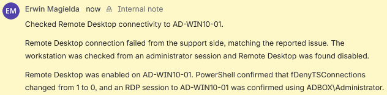

*Figure 11 - Internal note recording the Remote Desktop check, fix, and validation.*

A customer-facing reply was sent to explain the fix in plain language.

Figure 12 shows the customer reply.

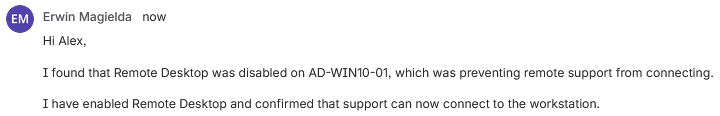

*Figure 12 - Customer reply confirming that Remote Desktop support can now connect.*

## Closure

The ticket was moved to `Done` after Remote Desktop was enabled, PowerShell confirmed that connections were allowed, the administrator RDP session was validated, and the customer was updated.

Figure 13 shows the final Jira state.

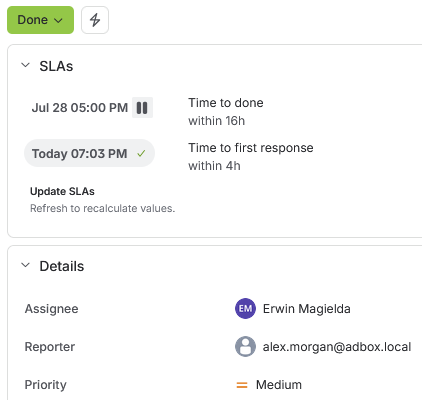

*Figure 13 - N3-3 closed after Remote Desktop connectivity was restored.*

## Result

N3-3 was resolved by identifying that Remote Desktop was disabled on `AD-WIN10-01`.

The connection failure was reproduced from the support side, the disabled state was confirmed through Windows Settings and PowerShell, Remote Desktop was enabled from an administrator session, PowerShell confirmed that `fDenyTSConnections` changed from `1` to `0`, an administrator RDP session to `AD-WIN10-01` was validated, the Jira ticket was updated internally, the customer was informed, and the ticket was closed.