# N3-4 // Account Keeps Locking

## Ticket Summary

This ticket was raised through the N3 Jira Service Management portal as part of the live queue simulation.

| Field             | Value                                      |
| ----------------- | ------------------------------------------ |
| Jira Key          | N3-4                                       |
| Request Type      | Account locked                             |
| Reporter          | `sam.taylor@adbox.local`                   |
| Affected User     | Sam Taylor                                 |
| ADBox Account     | `ADBOX\sam.taylor`                         |
| UPN               | `sam.taylor@adbox.local`                   |
| Workstation       | `AD-WIN10-01`                              |
| Starting Priority | High                                       |
| Starting Status   | In Progress                                |
| Final Status      | Done                                       |

## Reported Issue

Sam Taylor reported that they could not sign in because the domain account kept getting locked.

The ticket recorded the affected user, ADBox username, UPN, workstation, reported account locked message, start time, and user notes about repeated sign-in attempts.

Figure 1 shows the ticket details captured from Jira.

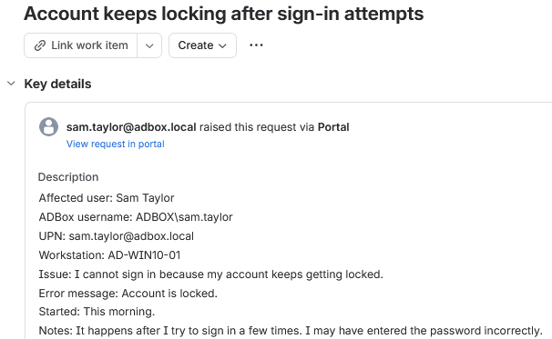

*Figure 1 - Jira ticket details for the reported account lockout issue.*

## Triage

The ticket was treated as a high priority identity issue because the affected user could not sign in to the assigned workstation.

| Area     | Value                                                     |
| -------- | --------------------------------------------------------- |
| Impact   | User unable to access `AD-WIN10-01` with domain account.  |
| Urgency  | High, workstation sign-in was blocked.                    |
| Priority | High                                                      |
| Queue    | Identity and access                                       |
| Owner    | Erwin Magielda                                            |

## Investigation

The sign-in failure was confirmed from `AD-WIN10-01`.

The Windows sign-in screen showed that Sam Taylor's account was currently locked out and could not be used to log on.

Figure 2 shows the client-side lockout message.

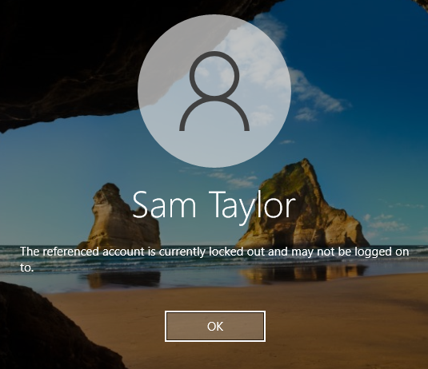

*Figure 2 - AD-WIN10-01 showing the account lockout message for Sam Taylor.*

The domain account policy was checked to confirm whether repeated failed sign-in attempts could lock an account.

```cmd
net accounts /domain
```

| Output Field                    | Result       |
| ------------------------------- | ------------ |
| Lockout threshold               | 3            |
| Lockout duration                | 30 minutes   |
| Lockout observation window      | 30 minutes   |

The policy confirmed that repeated failed sign-in attempts could lock the account, matching the user note that the issue happened after trying to sign in a few times.

Figure 3 shows the domain lockout policy check.

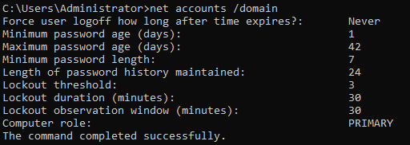

*Figure 3 - Domain account policy showing a lockout threshold of 3 failed attempts.*

The affected account was then checked in Active Directory Users and Computers on `AD-SRV01`.

The Account tab showed that `sam.taylor` was currently locked out on the domain controller.

Figure 4 shows the ADUC lockout state.

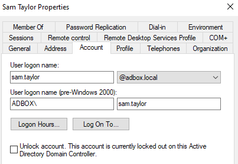

*Figure 4 - Sam Taylor account shown as locked out in ADUC.*

PowerShell was also used to confirm the same account state from the command line.

```powershell
Get-ADUser sam.taylor -Properties LockedOut |
Select-Object Name,SamAccountName,LockedOut
```

| Part                       | Purpose                                      |
| -------------------------- | -------------------------------------------- |
| `Get-ADUser sam.taylor`    | Queries the affected ADBox user account.     |
| `-Properties LockedOut`    | Includes the account lockout state.          |
| `Select-Object`            | Limits the output to the required fields.    |
| `Name`                     | Shows the display name.                      |
| `SamAccountName`           | Shows the AD username.                       |
| `LockedOut`                | Shows whether the account is locked.         |

The command returned `LockedOut = True`, confirming that the account was locked in both ADUC and PowerShell.

Figure 5 shows the PowerShell locked-state check.

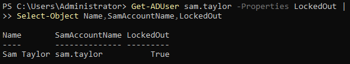

*Figure 5 - PowerShell confirming that `sam.taylor` was locked out.*

## Finding

The issue was caused by the `sam.taylor` Active Directory account being locked out under the domain account lockout policy.

| Check                  | Result                                        |
| ---------------------- | --------------------------------------------- |
| Client sign-in         | Account locked message displayed.             |
| Domain policy          | Lockout threshold set to 3 failed attempts.   |
| ADUC Account tab       | Account shown as currently locked out.        |
| PowerShell check       | `LockedOut = True`.                           |
| Root cause             | Locked AD account after repeated attempts.    |

## Resolution Applied

The account was unlocked from Active Directory Users and Computers by using the `Unlock account` option on the Account tab.

This was the primary support action used for the ticket because the locked state had already been confirmed from the same user properties window.

Figure 6 shows the unlock option selected.

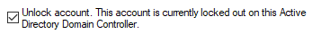

*Figure 6 - Unlock account selected for `sam.taylor`.*

After the change was applied, the lockout message disappeared from the Account tab and the checkbox returned to its normal state.

Figure 7 shows the unlock action after it was applied.

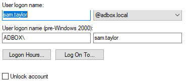

*Figure 7 - Sam Taylor account after the unlock action was applied.*

## PowerShell Validation

The account state was checked again after the ADUC fix was applied.

```powershell
Get-ADUser sam.taylor -Properties LockedOut |
Select-Object Name,SamAccountName,LockedOut
```

The command returned `LockedOut = False`, confirming that the account was no longer locked.

Figure 8 shows the post-fix PowerShell validation.

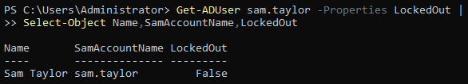

*Figure 8 - PowerShell confirming that `sam.taylor` was no longer locked out.*

## Client Validation

Sign-in was tested again from `AD-WIN10-01`.

The Windows sign-in process accepted the account and reached the user desktop.

Figure 9 shows the successful sign-in after the account was unlocked.

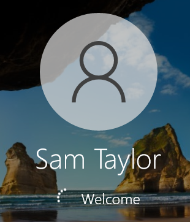

*Figure 9 - Sam Taylor signing in successfully after the account unlock.*

The signed-in session was then confirmed with command-line checks.

```cmd
whoami
hostname
ipconfig /all
```

| Check      | Result              |
| ---------- | ------------------- |
| `whoami`   | `adbox\sam.taylor`  |
| `hostname` | `AD-WIN10-01`       |
| DNS Suffix | `adbox.local`       |

Figure 10 shows the client-side validation.

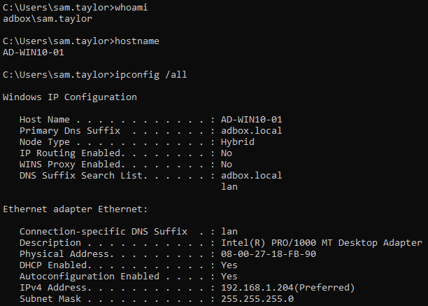

*Figure 10 - AD-WIN10-01 signed in as `adbox\sam.taylor` after the account was unlocked.*

## Alternative Methods

The same account lockout issue could also be resolved through other valid administrative methods.

| Method           | Action                                   | Use                                                      |
| ---------------- | ---------------------------------------- | -------------------------------------------------------- |
| ADUC Account tab | Tick `Unlock account` and apply.         | Primary method used in this ticket.                      |
| PowerShell       | `Unlock-ADAccount -Identity sam.taylor`. | Repeatable command-line method for account unlocks.      | 

PowerShell was documented as an equivalent command-line method.

```powershell
Unlock-ADAccount -Identity sam.taylor
```

| Part                         | Purpose                              |
| ---------------------------- | ------------------------------------ |
| `Unlock-ADAccount`           | Unlocks an Active Directory account. |
| `-Identity sam.taylor`       | Targets the affected ADBox user.     |

Figure 11 shows the PowerShell unlock method.

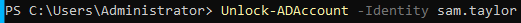

*Figure 11 - Alternative PowerShell method for unlocking `sam.taylor`.*

## Jira Notes

An internal note was added to the ticket to record the technical finding, fix, and validation.

Figure 12 shows the internal note.

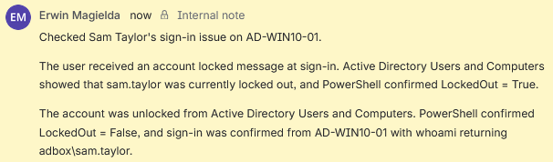

*Figure 12 - Internal note recording the account lockout check, unlock action, and client validation.*

A customer-facing reply was sent to explain the fix in plain language.

Figure 13 shows the customer reply.

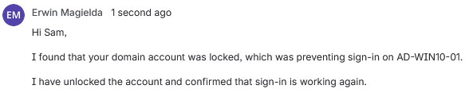

*Figure 13 - Customer reply confirming that sign-in was working again.*

## Closure

The ticket was moved to `Done` after the account was unlocked, PowerShell confirmed that `LockedOut = False`, sign-in was validated from `AD-WIN10-01`, and the customer was updated.

Figure 14 shows the final Jira state.


*Figure 14 - N3-4 closed after the account lockout issue was resolved.*

## Result

N3-4 was resolved by identifying that `ADBOX\sam.taylor` was locked out under the domain account lockout policy.

The lockout was reproduced from `AD-WIN10-01`, the domain policy confirmed that repeated failed attempts could lock accounts, the locked state was confirmed through ADUC and PowerShell, the account was unlocked from ADUC, PowerShell confirmed that `LockedOut` changed from `True` to `False`, sign-in was validated from `AD-WIN10-01`, the Jira ticket was updated internally, the customer was informed, and the ticket was closed.