# N3-5 // Cannot Reach AD-SRV01 Domain Resources

## Ticket Summary

This ticket was raised through the N3 Jira Service Management portal as part of the live queue simulation.

| Field             | Value                                                       |
| ----------------- | ----------------------------------------------------------- |
| Jira Key          | N3-5                                                        |
| Request Type      | Network and domain resource issue                            |
| Reporter          | `jamie.carter@adbox.local`                                  |
| Affected User     | Jamie Carter                                                |
| ADBox Account     | `ADBOX\jamie.carter`                                        |
| UPN               | `jamie.carter@adbox.local`                                  |
| Workstation       | `AD-WIN10-01`                                               |
| Affected Resource | `AD-SRV01` domain resources                                 |
| Starting Priority | Highest                                                     |
| Starting Status   | In Progress                                                 |
| Final Status      | Done                                                        |

## Reported Issue

Jamie Carter reported that they could not reach the server or domain resources normally used from `AD-WIN10-01`.

The ticket recorded the affected user, ADBox username, UPN, workstation, affected resource, reported network error, start time, and user note that internet access appeared to work while `AD-SRV01` and domain resources were unavailable.

Figure 1 shows the ticket details captured from Jira.

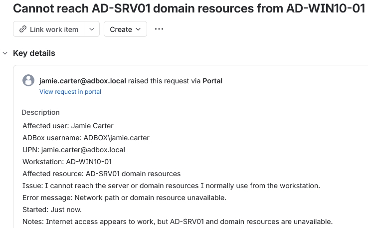

*Figure 1 - Jira ticket details for the reported domain resource access issue.*

## Triage

The ticket was treated as a highest priority network and domain resource issue because access to expected server resources was blocked from the affected workstation.

| Area     | Value                                                              |
| -------- | ------------------------------------------------------------------ |
| Impact   | User could not access expected `AD-SRV01` domain resources.         |
| Urgency  | Highest, domain resource access was unavailable from the workstation. |
| Priority | Highest                                                            |
| Queue    | Network and endpoint                                                |
| Owner    | Erwin Magielda                                                     |

## Investigation

The issue was reproduced from `AD-WIN10-01` using Jamie Carter's user session.

Opening the expected shared resource failed with a Windows network error.

```text
\\AD-SRV01.adbox.local\Sales
```

Figure 2 shows the failed resource access attempt.

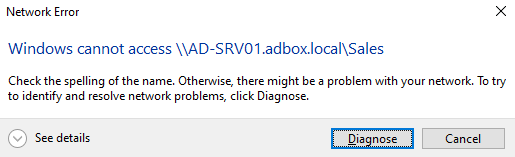

*Figure 2 - AD-WIN10-01 failing to access `\\AD-SRV01.adbox.local\Sales`.*

The client network configuration was checked with `ipconfig /all`.

```cmd
ipconfig /all
```

The workstation had a valid IP address and domain suffix, but the DNS server was set to `8.8.8.8` instead of the ADBox domain DNS server.

| Setting              | Result             |
| -------------------- | ------------------ |
| Hostname             | `AD-WIN10-01`      |
| IPv4 Address         | `192.168.1.204`    |
| DNS suffix           | `adbox.local`      |
| DNS server observed  | `8.8.8.8`          |
| Expected DNS server  | `192.168.1.50`     |

Figure 3 shows the incorrect DNS server on the affected workstation.

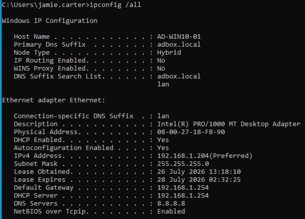

*Figure 3 - AD-WIN10-01 using `8.8.8.8` for DNS.*

A domain name lookup was then tested for `AD-SRV01.adbox.local`.

```cmd
nslookup AD-SRV01.adbox.local
```

The lookup was sent to `dns.google` at `8.8.8.8`, which returned a non-existent domain result for the internal ADBox hostname.

Figure 4 shows the failed domain lookup.

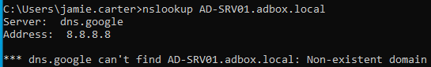

*Figure 4 - External DNS failing to resolve the internal ADBox server name.*

The IPv4 adapter configuration was also checked through the Windows GUI. The adapter was manually configured to use `8.8.8.8` as the preferred DNS server.

Figure 5 shows the incorrect DNS setting in the GUI.

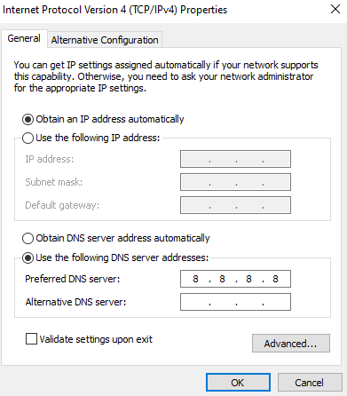

*Figure 5 - IPv4 DNS setting showing `8.8.8.8` before the fix.*

PowerShell was used to confirm the same DNS configuration from the command line.

```powershell
Get-DnsClientServerAddress -InterfaceAlias "Ethernet" -AddressFamily IPv4
```

The output showed `8.8.8.8` as the configured IPv4 DNS server.

Figure 6 shows the pre-fix PowerShell DNS check.

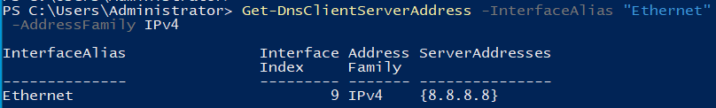

*Figure 6 - PowerShell confirming the incorrect DNS server on `AD-WIN10-01`.*

## Finding

The issue was caused by `AD-WIN10-01` using an external DNS server instead of the ADBox domain DNS server.

Because ADBox domain records are hosted by `AD-SRV01`, the client could not resolve `AD-SRV01.adbox.local` while pointed at `8.8.8.8`.

| Check                  | Result                                                       |
| ---------------------- | ------------------------------------------------------------ |
| Resource access         | `\\AD-SRV01.adbox.local\Sales` failed.                      |
| Client DNS setting      | DNS server was `8.8.8.8`.                                    |
| Domain lookup           | `AD-SRV01.adbox.local` failed through `dns.google`.           |
| Expected DNS server     | `192.168.1.50`, the ADBox DNS server on `AD-SRV01`.           |
| Root cause              | Incorrect DNS server configured on `AD-WIN10-01`.             |

## Resolution Applied

The primary fix was applied through the Windows network adapter GUI on `AD-WIN10-01`.

The IPv4 DNS setting was corrected to use the ADBox domain DNS server.

```text
Preferred DNS server: 192.168.1.50
```

Figure 7 shows the corrected DNS setting in the GUI.

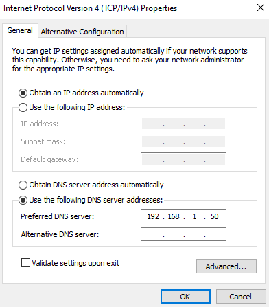

*Figure 7 - IPv4 DNS setting corrected to `192.168.1.50`.*

## PowerShell Validation

PowerShell was used to validate the corrected DNS server after the GUI fix.

```powershell
Get-DnsClientServerAddress -InterfaceAlias "Ethernet" -AddressFamily IPv4
```

| Part                                      | Purpose                                      |
| ----------------------------------------- | -------------------------------------------- |
| `Get-DnsClientServerAddress`              | Reads the configured DNS server addresses.   |
| `-InterfaceAlias "Ethernet"`             | Targets the affected network adapter.        |
| `-AddressFamily IPv4`                     | Limits the output to IPv4 DNS configuration. |

The command returned `192.168.1.50`, confirming that `AD-WIN10-01` was using the ADBox DNS server.

Figure 8 shows the post-fix PowerShell DNS check.

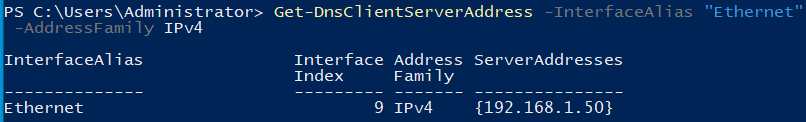

*Figure 8 - PowerShell confirming `192.168.1.50` as the configured DNS server.*

The corrected DNS setting was also confirmed from the client session using `ipconfig /all`.

```cmd
ipconfig /all
```

Figure 9 shows the corrected DNS server from the client network configuration.

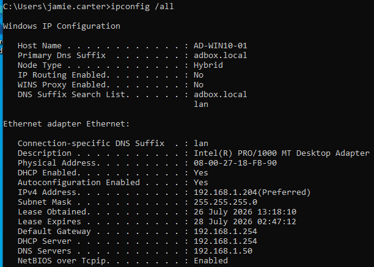

*Figure 9 - AD-WIN10-01 showing `192.168.1.50` as the DNS server after the fix.*

## Domain Lookup Validation

The internal server name was tested again after the DNS correction.

```cmd
nslookup AD-SRV01.adbox.local
```

The lookup resolved successfully through `192.168.1.50` and returned the internal server address.

| Lookup Target              | Result             |
| -------------------------- | ------------------ |
| `AD-SRV01.adbox.local`     | Resolved           |
| DNS server used            | `192.168.1.50`     |
| IPv4 result                | `192.168.1.50`     |

Figure 10 shows the successful domain lookup.

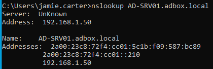

*Figure 10 - `AD-SRV01.adbox.local` resolving successfully through the ADBox DNS server.*

## Client Validation

The affected shared resource was opened again from `AD-WIN10-01`.

```text
\\AD-SRV01.adbox.local\Sales
```

The folder opened successfully and the expected files were visible.

Figure 11 shows the restored resource access.

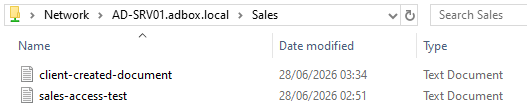

*Figure 11 - `\\AD-SRV01.adbox.local\Sales` opening successfully after the DNS correction.*

## Alternative Methods

The same DNS correction can also be applied through PowerShell.

```powershell
Set-DnsClientServerAddress -InterfaceAlias "Ethernet" -ServerAddress 192.168.1.50
```

| Part                                  | Purpose                                      |
| ------------------------------------- | -------------------------------------------- |
| `Set-DnsClientServerAddress`          | Sets DNS server addresses on a network adapter. |
| `-InterfaceAlias "Ethernet"`         | Targets the affected Ethernet adapter.       |
| `-ServerAddress 192.168.1.50`         | Sets DNS to the ADBox DNS server.             |

Figure 12 shows the PowerShell method for setting the DNS server.


*Figure 12 - Alternative PowerShell method for setting DNS to `192.168.1.50`.*

## Jira Notes

An internal note was added to the ticket to record the technical finding, fix, and validation.

Figure 13 shows the internal note.

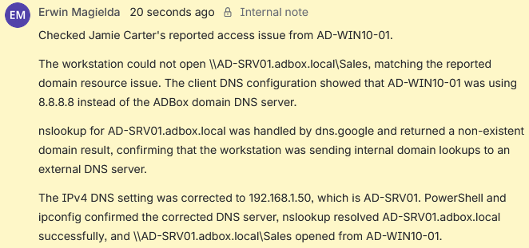

*Figure 13 - Internal note recording the DNS misconfiguration, correction, and validation.*

A customer-facing reply was sent to explain the fix in plain language.

Figure 14 shows the customer reply.

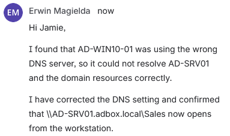

*Figure 14 - Customer reply confirming that domain resource access was restored.*

## Closure

The ticket was moved to `Done` after DNS was corrected, PowerShell confirmed the DNS server, internal domain lookup succeeded, the shared resource opened from `AD-WIN10-01`, and the customer was updated.

Figure 15 shows the final Jira state.

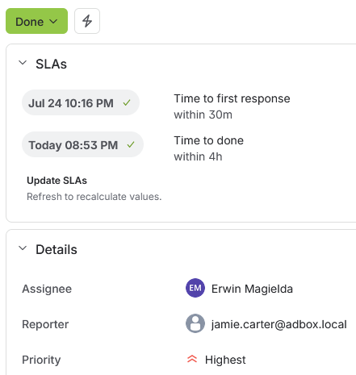

*Figure 15 - N3-5 closed after domain resource access was restored.*

## Result

N3-5 was resolved by identifying that `AD-WIN10-01` was using `8.8.8.8` instead of `192.168.1.50` for DNS.

The incorrect DNS setting caused internal ADBox names such as `AD-SRV01.adbox.local` to fail lookup through external DNS. The DNS server was corrected to `192.168.1.50`, PowerShell and `ipconfig` confirmed the corrected client configuration, `nslookup` resolved `AD-SRV01.adbox.local`, the Sales share opened successfully from `AD-WIN10-01`, the Jira ticket was updated internally, the customer was informed, and the ticket was closed.